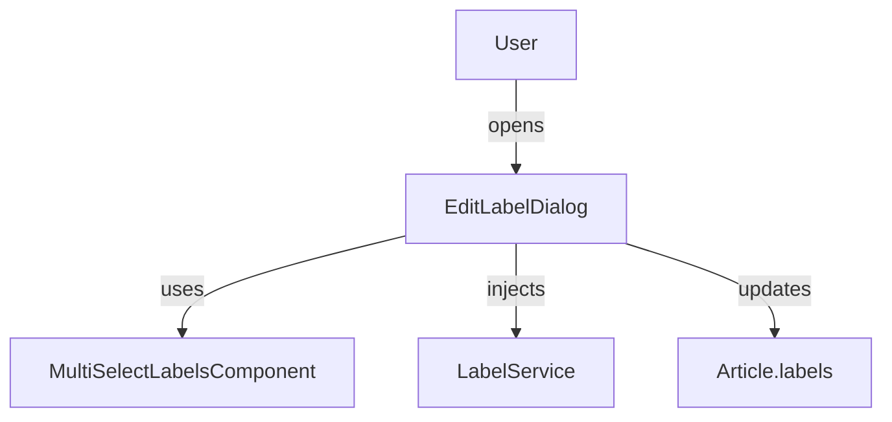

The `EditLabelDialog` component provides a dialog interface for editing labels on an article or item. It supports both public and private labels, integrates with the `MultiSelectLabelsComponent` for label entry, and uses the `LabelService` for access control and persistence.

## Usage

```ts
import { EditLabelDialog } from '@angular/atomic-angular';

@Component({
  selector: 'my-component',
  template: `
    <edit-label-dialog [article]="article" />
  `,
  imports: [EditLabelDialog]
})
export class MyComponent {
  article = { /* ... */ };
}
```

## Features

- Dialog UI for editing labels
- Supports both public and private labels
- Integrates with label suggestions and i18n
- Uses `LabelService` for access control and saving

## Process Schema



## Notes

- The dialog checks user rights before allowing label editing.
- It can be used in toolbars, context menus, or as part of a workflow.
