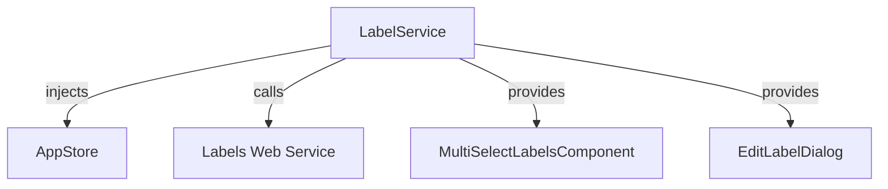

The `LabelService` provides methods for managing labels, including fetching label suggestions, checking user rights, and persisting label changes. It acts as the main interface between label UI components and the backend label service.

## Features

- Fetch label suggestions for articles/items
- Check user rights for label editing (public/private)
- Persist label changes to the backend
- Integrates with application store for configuration

## Key Methods

| Method                | Description                                 |
|----------------------|---------------------------------------------|
| `canHandleLabels()`  | Checks if the current user can edit labels  |
| `fetchLabels()`      | Fetches label suggestions from backend      |
| `saveLabels()`       | Persists label changes (if implemented)     |

## Usage Example

```ts
import { LabelService } from '@angular/atomic-angular';

@Component({
  ...,
})
export class MyComponent {
  constructor(private labelService: LabelService) {}

  async checkAccess() {
    const canEdit = await this.labelService.canHandleLabels();
    // ...
  }
}
```

## Service Interaction Schema



## Notes

- User rights and label config are determined via the backend and application store.
- The service is provided in root and can be injected anywhere in the app.
