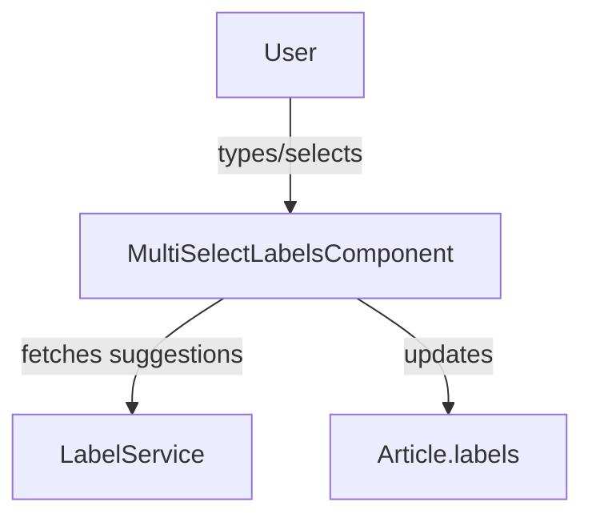

The `Multiselect Labels` feature allows users to search within all labels, or to create some, to apply them on an article. It displays an input to search or create, and below it are the badges of all applied ones which can also be removed on click.

## Usage

```ts title="sample.component.ts"
import { MultiSelectLabelsComponent } from "@angular/atomic-angular";

@Component({
    selector: "sample-component",
    imports: [MultiSelectLabelsComponent],
    template: `
    <multiselect-labels
        [(article)]="article"
        labelsField="publicLabels"
        [isPublic]="true"
        [allowModification]="false"  
    />
    `,
})
export class SampleComponent {
    article = { /* ... */ };
}
```

### Properties

| Property             | Type                         | Description                                          |
|----------------------|------------------------------|------------------------------------------------------|
| `article`            | `model<Article>`             | The article to manage the labels for                 |
| `isPublic`           | `input<boolean>`             | Whether it is for public or private labels           |
| `allowModification`  | `input<boolean>`             | Whether the currently applied labels can be removed  |
| `labelsField`        | `input<string \| undefined>` | The article field for labels                         |

### Methods

| Method                      | Description                                               |
|-----------------------------|-----------------------------------------------------------|
| `itemClicked(label)`        | On click on a suggested item to apply it                  |
| `onInputClick()`            | On input click to open the popover                        |
| `onKeyDown(event)`          | Watches input keydown to create the label if Enter is hit |
| `fetchLabels(text, isPublic)` | Fetches label suggestions based on the input text         |
| `addLabel(label, isPublic)` | Adds a label to the article labels                        |
| `updateArticleWithLabels()` | Updates the article object with the current labels         |

### Features

- Displays the currently applied labels
- Displays an input to write some new label name or search for some displayed in a suggestion popover
- Add and remove labels with keyboard or mouse
- Suggest labels as you type (with debounced input)
- Supports both public and private labels
- Integrates with i18n for UI strings

## Process Schema



## Notes

- Suggestions are fetched from the backend via the `LabelService`.
- The component is fully standalone and can be used in dialogs or forms.
