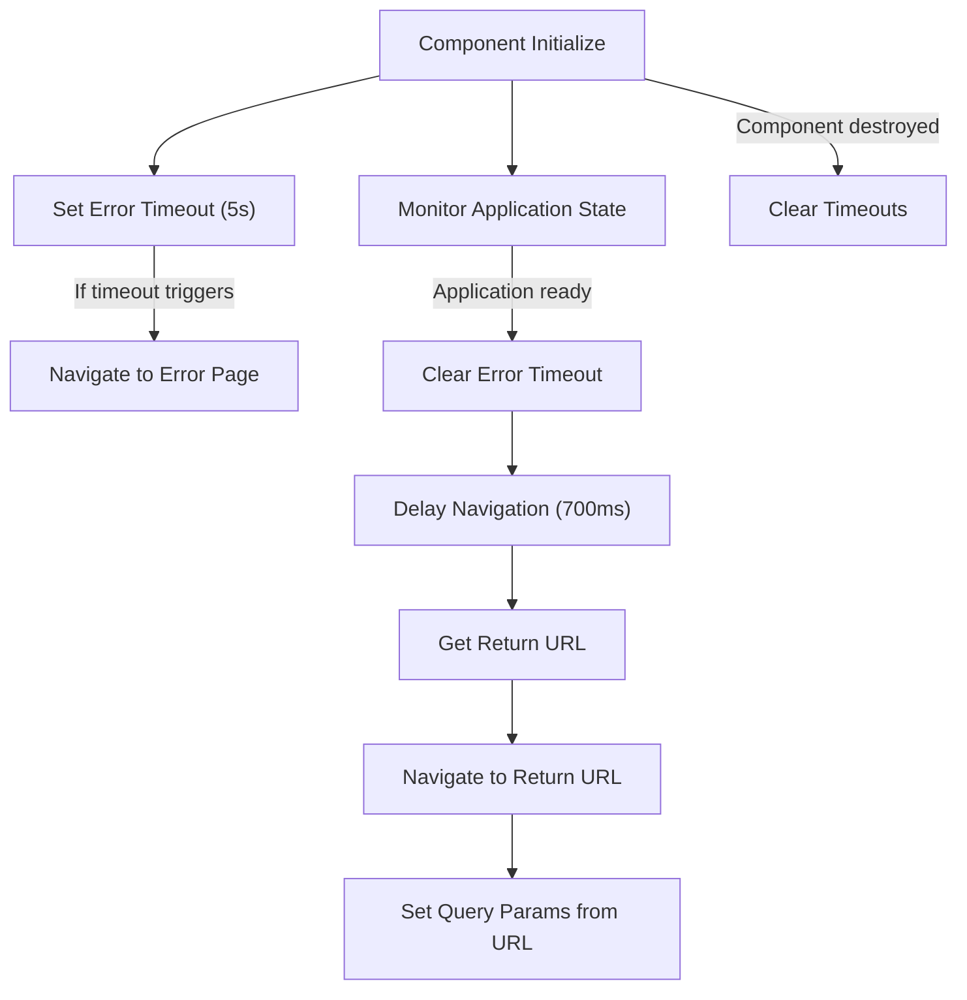
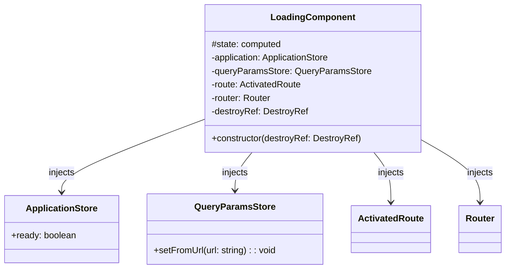
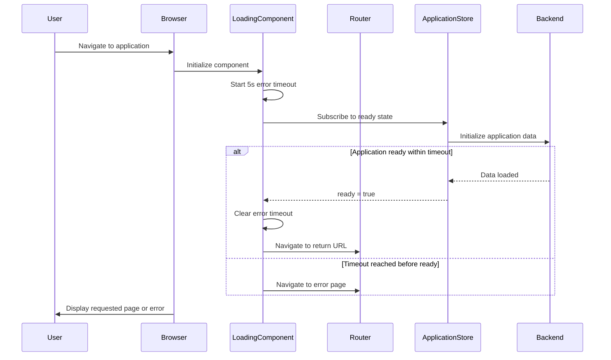

The `Loading` component provides a visually appealing spinner that displays during application initialization or route transitions, with automatic timeout and error handling.

## Usage

```ts title="sample.component.ts"
import { LoadingComponent } from "@angular/atomic-angular";

@Component({
    selector: "sample-component",
    imports: [LoadingComponent],
    template: `
    <app-wait />
    `,
}) export class SampleComponent {
    // The component automatically handles application initialization state
    // and redirects to the return URL once the application is ready
}
```

## Properties

| Property | Type | Description |
|---|---|---|
| `state` | `computed<ApplicationState>` | Computed property that returns the current state of the application. |

## Features

- Displays an animated spinner during application loading
- Automatically redirects to error page after 5 seconds timeout if loading fails
- Cleans up timeouts to prevent memory leaks when component is destroyed
- Manages redirection based on query parameters
- Handles application initialization state
- Uses Angular signals and effects for reactive behavior

## Extending the Loading Component

External developers can extend this component to customize it for their specific needs. Here's how to create a custom loading component:

```ts title="custom-loading.component.ts"
import { Component } from '@angular/core';
import { LoadingComponent } from '@angular/atomic-angular';

@Component({
  selector: 'custom-wait',
  template: `
    <div class="custom-container">
      <div class="custom-spinner">
        <span class="loader"></span>
        <p class="loading-text">Loading your application...</p>
      </div>
    </div>
  `,
  styles: [`
    .custom-container {
      display: flex;
      height: 100vh;
      width: 100%;
      align-items: center;
      justify-content: center;
      background-color: #f5f5f5;
    }
    .custom-spinner {
      display: flex;
      flex-direction: column;
      align-items: center;
      gap: 1rem;
    }
    .loading-text {
      font-size: 1.5rem;
      color: #0040bf;
    }
  `]
})
export class CustomLoadingComponent extends LoadingComponent {
  // You can override methods or add additional properties
  
  // Example of overriding the timeout duration
  constructor() {
    super(inject(DestroyRef));
    
    // Custom initialization logic here
    this.initializeWithCustomTimeout(10000); // 10 seconds instead of 5
  }
  
  // Custom method example
  initializeWithCustomTimeout(timeoutDuration: number) {
    // Custom implementation
    const timeout = setTimeout(() => {
      this.router.navigate(['/custom-error'], {
        queryParams: { returnUrl: this.route.snapshot.queryParams['returnUrl'] }
      });
    }, timeoutDuration);
    
    this.destroyRef.onDestroy(() => {
      clearTimeout(timeout);
    });
  }
}
```

### Customization Options

When extending the loading component, consider customizing these aspects:

1. **Visual Appearance**:
   - Modify the spinner style or replace it with a custom animation
   - Add branding elements like logos or colors
   - Include loading messages or progress indicators

2. **Behavior Customization**:
   - Change timeout duration before showing error page
   - Add loading progress detection
   - Implement retry mechanisms
   - Override navigation targets

3. **Additional Features**:
   - Add loading percentage displays
   - Implement connection status monitoring
   - Display helpful tips or information during loading
   - Add accessibility enhancements

## Template Structure

```html
<div class="flex h-[100dvh] w-full items-center justify-center">
  <div class="flex flex-col items-center space-y-4">
    <span class="loader"></span>
  </div>
</div>
```

## Visual Schema

### Component Flow Diagram



### Component Architecture



### Application Initialization Flow


