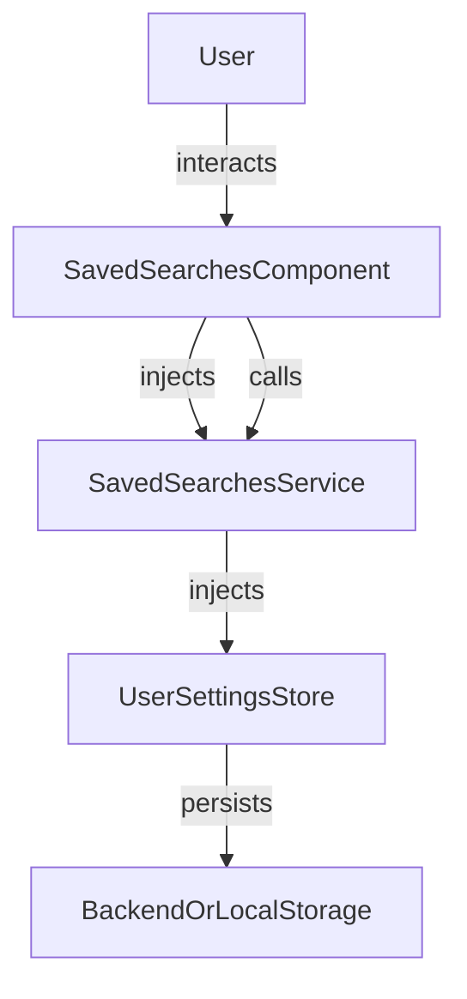

The `SavedSearches` feature allows users to see, manage, and re-execute custom search queries. It provides persistence and quick access to frequently used or complex searches.

## Usage

```ts title="sample.component.ts"
import { SavedSearchesComponent } from "@angular/atomic-angular";

@Component({
    selector: "sample-component",
    template: `
    <saved-searches />
    `,
})
export class SampleComponent {
    // The component automatically loads and displays saved searches
}
```

### Properties

| Property         | Type                           | Description                                 |
|-----------------|--------------------------------|---------------------------------------------|
| `range`   | `signal<number>`   | The current range of displayed saved search queries                    |
| `savedSearches` | `signal<SavedSearch[]>`    | List of all saved search queries                |
| `paginatedSearches` | `signal<SavedSearch[]>`    | List of the displayed saved search queries                |
| `hasMore`         | `computed<boolean>`            | Whether there are more saved search queries to be displayed              |

### Methods

| Method                | Description                                 |
|----------------------|---------------------------------------------|
| `onClick(savedSearch)`  | Redirects to the saved search results page              |
| `onDelete(index, event)`| Removes a saved search                      |
| `loadMore(event)`| Expands the range to display more saved search queries    |

### Features

- See, remove, and re-execute search queries
- Persistent storage (local or backend)
- UI for managing saved searches
- Integrates with search and navigation services

## Visual Schema



## Customization

You can customize the behavior and display of the saved searches feature using the `SAVED_SEARCHES_CONFIG` injection token. It allows you to configure options such as pagination, the visibility of the "Load More" button, and the route used for saved searches navigation.

### SAVED_SEARCHES_CONFIG Injection Token

`SAVED_SEARCHES_CONFIG` is an Angular injection token that provides the saved searches configuration to the `SavedSearchesComponent` and related services. By default, it uses `SAVED_SEARCHES_OPTIONS`, but you can override it at the application or component level.

#### Example: Providing Custom Options (Standalone API)

```ts
import { SAVED_SEARCHES_CONFIG, SavedSearchesConfig, SavedSearchesComponent } from '@sinequa/atomic-angular';

const customSavedSearchesOptions: SavedSearchesConfig = {
  itemsPerPage: 25,
  showLoadMore: false,
  routerLink: '/my-saved-searches'
};

@Component({
  selector: 'app-root',
  imports: [SavedSearchesComponent],
  providers: [
    { provide: SAVED_SEARCHES_CONFIG, useValue: customSavedSearchesOptions }
  ],
  template: `<saved-searches />`
})
export class AppComponent {}
```

This approach allows you to:

- Change pagination and display options for saved searches
- Customize routing and UI behavior
- Apply different configurations in different parts of your app

See the `SAVED_SEARCHES_CONFIG` definition in your codebase for all available options.

## Notes

- Saved searches are useful for recurring or complex queries.
- The component can be used in search toolbars, drawers, or as a dedicated page.
