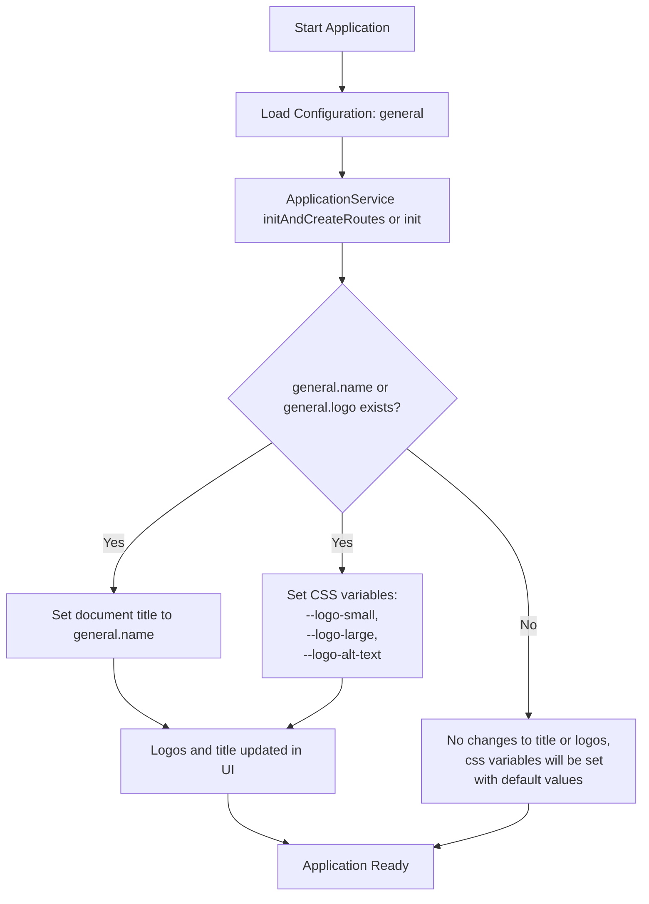

import useBaseUrl from '@docusaurus/useBaseUrl';

## How It Works

The application title and logos are set dynamically at startup by the `bootstrapApp()` function.

- `bootstrapApp()` is invoked during application startup, as part of the Angular app initialization process.
- In your `app.config.ts`, the following line ensures this happens:

  ```ts title="app.config.ts"
  import { bootstrapApp } from '@sinequa/atomic-angular';

  export const appConfig: ApplicationConfig = {
    providers: [
      provideAppInitializer(() =>
        // add
        bootstrapApp(inject(Router), inject(ApplicationService), { createRoutes: true })
      ),
      /*...*/
    ],
  };

  ```

- The `bootstrapApp` function will call `initAndCreateRoutes()` or `init()` depending on the `createRoutes` value
on the `ApplicationService` as part of the bootstrapping process.

### What Does It Do?

- Sets the browser tab title to your configured application name.
- Sets CSS custom properties for your logos:
  - `--logo-small` (for small logo)
  - `--logo-large` (for large logo)
  - `--logo-alt-text` (for accessibility/alt text)
- These CSS variables can be used in your styles or HTML to display the logos.

## How to Use the Configuration

### Set Up Your Customization

Set the configuration in customization (JSON) section of the Sinequa administration.


### Customize Logos and Title

Ensure the `general` custom file is present with the required properties.

```json title="general: JSON configuration in Sinequa Administration"
{
  "general": {
    "name": "My Custom App",                 // The application title (sets the browser tab title)
    "logo": {
      "light": {
        "small": "/assets/logo-small.png",   // URL for the small logo (used in CSS variable --logo-small)
        "large": "data:image/png;base64,..." // URL for the large logo (used in CSS variable --logo-large)
      },
      "alt": "My Custom App Logo"            // Alternate text for accessibility
                                             // (used in CSS variable --logo-alt-text)
    }
  }
}
```

- `name`: The application title (sets the browser tab title).
- `logo.light.small`: URL for the small logo (used in CSS variable `--logo-small`).
- `logo.light.large`: URL for the large logo (used in CSS variable `--logo-large`).
- `logo.alt`: Alternate text for accessibility (used in CSS variable `--logo-alt-text`).

### Usage in Your Application

Use the CSS variables in your styles or HTML to display the logos, for example:

   ```css
   #navbar-logo {
     content: var(--logo-small) / var(--logo-alt-text);
   }
   ```

## Workflow Schema: Customizing Logos and Title



- **Start Application**: The app starts and loads configuration (including `general`).
- **initAndCreateRoutes()**: Called during app initialization and reads the `general` config.
- **If `general.name` or `general.logo` exists**: Sets the document title and CSS variables for logos.
- **UI**: Uses these CSS variables to display the logos and title.
- **Application Ready**: The UI reflects your custom branding.

## Alternative: Customizing Logos and Title via styles.css

If the configuration JSON (`general` object) does not exist or is not loaded, your application will fall back to the default CSS variables defined in your `styles.css` file.

### How It Works

- In `styles.css`, CSS custom properties (variables) are set under the `@theme` block:

  ```css
  @theme {
    --logo-small: url('assets/logo/small.svg');
    --logo-large: url('assets/logo/large.svg');
    --logo-alt-text: 'Sinequa logo';
  }
  ```

- These variables are used throughout your application to display the logo and set the alt text.
- You can customize the default logo and title by editing these variables directly in `styles.css`.

:::note

- If no configuration JSON is present, `styles.css` provides the default branding.
- Edit the CSS variables in `styles.css` to set your application's logo and title appearance.

:::

## Summary

- `bootstrapApp()` is called automatically at app startup.
- Provide your custom title and logo URLs in the `general` config object as shown above.
- The UI will reflect your changes without further code modification.
