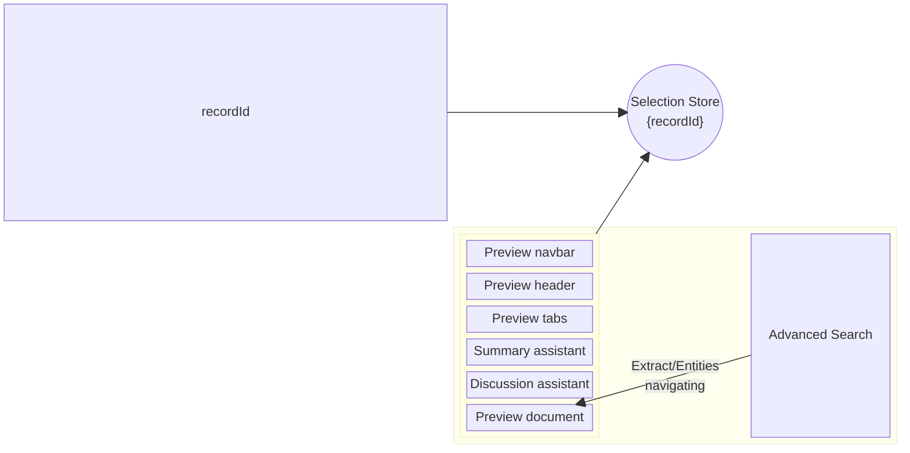
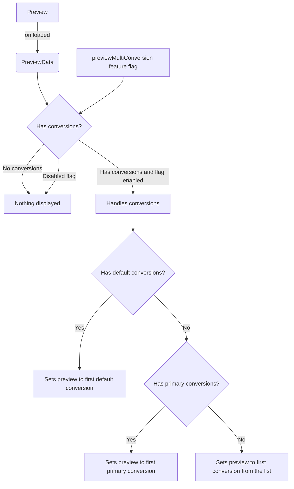

import useBaseUrl from '@docusaurus/useBaseUrl';

The Preview feature allows the viewing of the content of a document with many searching tools.
It is included in the side drawer opening upon clicking on a document in the results list.

## Architecture

The Preview component (`PreviewComponent`) is composed of many components:

- The Navbar (`PreviewNavbarComponent`) handling many actions related to the preview and document such as opening it in a new tab, adding it to the bookmarks or displaying the advanced search.
- The Header (`PreviewHeaderComponent`) displays the document's data such as the title, location, modified date and type.
- The Tabs (`PreviewTabsComponent`) displays some tabs navigation, used here to allow having a Summary and Discussion tabs to have the AI Assistant to respectively make a summary of the current document, and to chat about it. It is displayed if one of these assistants is allowed.
- The Assistant (`AssistantComponent`) for both the summary and discussion tabs.
- The Content (`PreviewContentComponent`) displaying the document content iframe.

It is included in a drawer component (`DrawerPreviewComponent`), from the `@sinequa/atomic-angular` library, which couples it with a search component (`AdvancedSearchComponent`) offering ways to interact with the preview content such as navigating through the found entities and extracts.

## How does the preview opens itself?

In order to open the preview drawer, multiple steps are at play:

- Upon clicking on an article in the results list, it is selected in the Selection Store and the drawer is asked to be opened
- When opening, the Drawer (`DrawerStackComponent`) takes the last selected article from the Selection Service (`SelectionHistoryService`) which is based on the Selection Store.
- The found article is then injected into the children component, here being the Preview Drawer
- The Preview then initializes itself based on the configuration to display the different elements (filters, tabs for the assistants)

## Multi conversion

### Workflow

If configured on the platform side, it can be enabled with the customization JSON's feature flag `previewMultiConversion`.
It is mainly handled inside `PreviewTabsComponent` which relies on the feature flag and `previewData.conversions` data fetched after the initial preview loading.

There are different steps going on:
- Upon loading the preview, we get the `previewData` which contains its `conversions` data
- Based on that and the feature flag, we select the first default conversion if any, or primary if any, and we display a dropdown at the end of the preview tabs to allow switching between them
- Upon choosing a conversion, it is transmitted to `PreviewContentComponent` which will use it for a couple of interactions:
  - use its URL for the preview iframe
  - in case we have a selected passage, we check if the document is primary, and if not there are no possible highlighting so we force a scrolling to the page (only works if HTML) that we first get through the `queryService.getDocPage` Service
- Choosing a conversion also emits it, which is then used by `PreviewNavbarComponent` to only display the button to toggle `AdvancedSearch` if the document is primary

### Workflow Diagram

