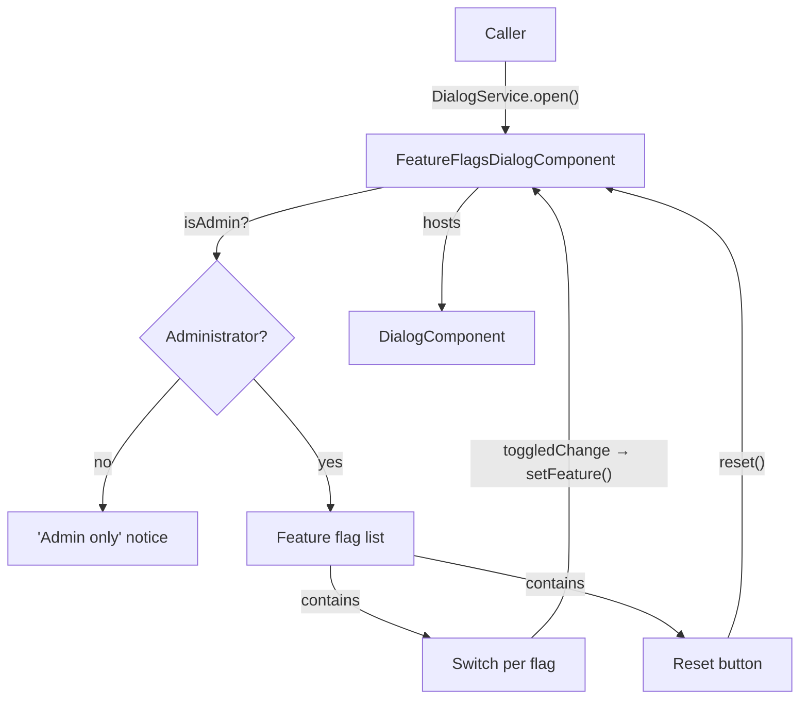
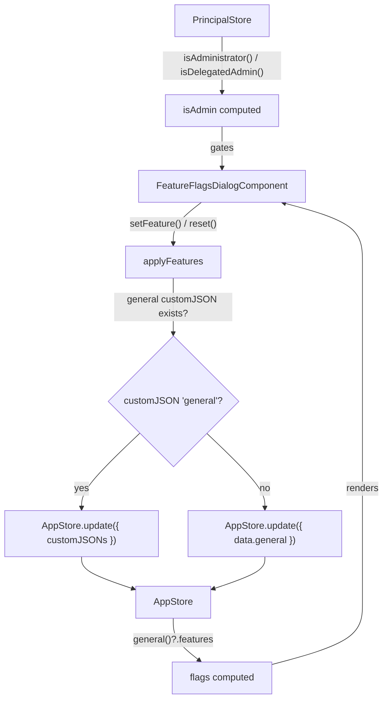

The `FeatureFlagsDialogComponent` is a developer/QA tool that lists the application's boolean feature flags and lets an **administrator** toggle them **live**. Each toggle rewrites the effective `general.features` map on the `AppStore`, so the rest of the application — which reads features through `appStore.general()?.features` — reacts immediately, with no customization-JSON edit and no reload.

Access is gated inside the component: the dialog always opens, but a non-administrator only sees an "admin only" notice. There is no content to leak and no caller-side check to maintain.

## Features

- Lists the known boolean feature flags (from the `CFeatures` type) with human-readable labels, plus any extra boolean flag found in the live configuration.
- Live toggling — changes are written straight to the `AppStore` and observed by the whole app.
- A search filter and a **Reset** action that restores the snapshot taken when the dialog was opened.
- **Admin gate built into the component** (`isAdministrator` or `isDelegatedAdmin` on the `PrincipalStore`); the mutators are no-ops for non-admins as a defensive guard.
- Safe writes: rewrites the whole `features` map into the exact source `general()` reads from (the `general` customJSON if present, otherwise inline `data.general`), so `AppStore.update()`'s shallow merge never clobbers the rest of `data`.

## Usage

Opened programmatically through the `DialogService`. It is typically bound to a global keyboard shortcut (e.g. `Ctrl+Shift+F` in the host application).

```ts title="sample.component.ts"
import { Component, inject } from "@angular/core";
import { FeatureFlagsDialogComponent } from "@sinequa/atomic-angular";
import { DialogService } from "@sinequa/ui";

@Component({
  selector: "sample-component",
  template: `<button (click)="openFeatureFlags()">Feature flags</button>`
})
export class SampleComponent {
  private readonly dialogService = inject(DialogService);

  openFeatureFlags(): void {
    this.dialogService.open(FeatureFlagsDialogComponent);
  }
}
```

## API Reference

### Inputs

_None — the dialog is opened programmatically via `DialogService.open()` and reads its data from the stores._

### Outputs

| Name | Payload | Description |
|---|---|---|
| `closed` | `DialogEvent` | Emitted when the dialog closes (`'dialog-close'`, `'dialog-cancel'`, …). Consumed by `DialogService` to tear down the dynamically created component. |

### Methods

| Name | Signature | Description |
|---|---|---|
| `open` | `open(): void` | Snapshots the current features (for `reset`) and shows the modal. Always opens, regardless of admin status. |

## Schemas

### Component Interaction



### Store Interaction



## Notes

- "Admin" means `isAdministrator` **or** `isDelegatedAdmin` on the `PrincipalStore`, aligned with the application's administration section.
- Only **boolean** feature flags are toggled. Object-valued features (`assistant`, `filters`, `userProfile`, …) are intentionally excluded from the list.
- Toggles apply live and are not persisted to the backend customization JSON — they affect the current session only, which is what makes the tool suitable for testing feature behaviour.
- `Reset` restores the features as they were when the dialog was opened, not a hard-coded default.
