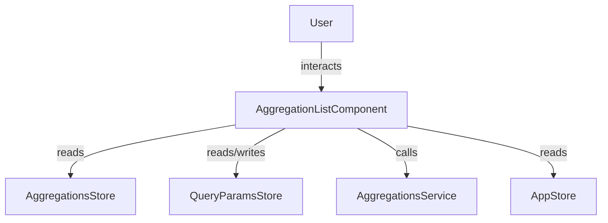
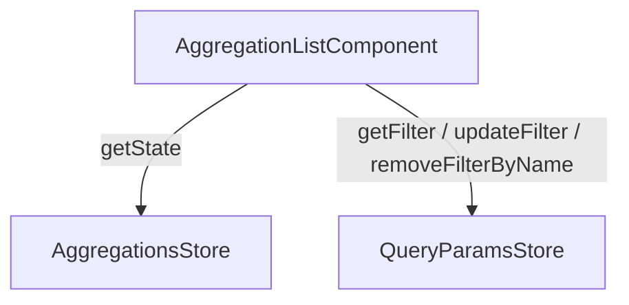

The `AggregationListComponent` displays a flat, scrollable list of aggregation values. Users can select one or more items and apply them as search filters.

## Features

- Multi-select list with checkbox-style items
- **Apply** button appears only when the selection differs from the last applied state
- Keyboard accessible: **Space** toggles an item, **Enter** applies the current selection
- Virtual scrolling for large item lists (thousands of items rendered without performance loss)
- Live search / suggest: type to filter items and fetch suggestions from the server
- Select all / Unselect all
- Load more: paginate through aggregation results
- Quick filter mode: a single click instantly applies a filter, bypassing the Apply button
- Multiple instances on the same page stay in sync automatically

## Usage

### Basic Example

```ts title="sample.component.ts"
import { AggregationListComponent } from "@sinequa/atomic-angular";

@Component({
  selector: "sample-component",
  imports: [AggregationListComponent],
  template: `
    <AggregationList
      name="FileExt"
      column="fileext"
      [collapsible]="true"
      [showFiltersCount]="true"
      (onApply)="onFiltersApplied()"
      (onClear)="onFiltersCleared()" />
  `,
})
export class SampleComponent {
  onFiltersApplied() { /* triggered after each apply */ }
  onFiltersCleared() { /* triggered after clear */ }
}
```

### Selectors

```html
<AggregationList ... />
<aggregation-list ... />
<aggregationlist ... />
```

### Interaction model

| Action | Result |
|---|---|
| Click an item | Toggles selection |
| Click item label *(quick filter mode)* | Instantly applies that single filter |
| **Space** on a focused item | Toggles selection |
| **Enter** on a focused item *(Apply visible)* | Applies the current selection |
| **Enter** on a focused item *(Apply not visible)* | Toggles selection |
| Click **Apply** | Applies all selected items as filters |
| Click **Clear** | Removes all active filters for this aggregation |
| Click **Select all** | Selects all visible items |
| Click **Unselect all** | Deselects all items |
| Click **Load more** | Fetches the next page of aggregation items |

## API Reference

### Inputs

| Name | Type | Default | Description |
|---|---|---|---|
| `name*` | `string \| null` | *(required)* | Name of the aggregation as defined in the search configuration. |
| `column*` | `string \| null` | *(required)* | Column name associated with the aggregation. |
| `id` | `string \| null` | `null` | HTML id forwarded to the panel header. |
| `class` | `string` | `""` | Additional CSS classes applied to the host element. |
| `collapsible` | `boolean` | `false` | Whether the panel can be collapsed by clicking the header. |
| `collapsed` | `boolean` | `false` | Initial collapsed state (only when `collapsible` is `true`). |
| `searchable` | `boolean \| undefined` | `undefined` | Overrides the aggregation's own `searchable` flag. When `undefined`, the aggregation configuration is used. |
| `showFiltersCount` | `boolean` | `false` | Shows a badge in the panel header with the number of active filters. |

### Outputs

| Name | Payload | Description |
|---|---|---|
| `onSelect` | `AggregationItem[]` | Emitted when an item is checked or unchecked. Carries the full list of currently selected items. |
| `onApply` | `void` | Emitted when the user applies the current selection. |
| `onClear` | `void` | Emitted when the user clears all active filters. |

### CSS Custom Properties

| Property | Default | Description |
|---|---|---|
| `--scroll-height` | `20rem` | Maximum height of the scrollable item area. Accepts any valid CSS length (`px`, `rem`, `vh`, etc.). |

```html
<!-- inline style -->
<AggregationList style="--scroll-height: 400px" ... />

<!-- Tailwind v4 arbitrary property -->
<AggregationList class="[--scroll-height:400px]" ... />

<!-- Tailwind v4 with responsive variant -->
<AggregationList class="[--scroll-height:20rem] lg:[--scroll-height:40rem]" ... />
```

### Feature flags *(from `AppStore`)*

| Feature | Effect |
|---|---|
| `showAggregationItemCount` | Shows the result count next to each item. |
| `quickFilter` | Clicking an item's label instantly applies a single-value filter, bypassing the Apply button. |

## Schemas

### Component Interaction



### Store Interaction



## Notes

- Use `AggregationList` for **flat** aggregations only. If the aggregation has `isTree: true`, use [`AggregationTree`](aggregation-tree.md) instead — an error will be displayed otherwise.
- The height of the scrollable area can be controlled using the `--scroll-height` CSS variable on the host element (e.g. `style="--scroll-height: 400px"`). Defaults to `20rem`.
- When multiple instances of the same aggregation coexist on the page (e.g. same filter in two side panels), all instances stay in sync: applying a filter from one instance is immediately reflected in all others.
