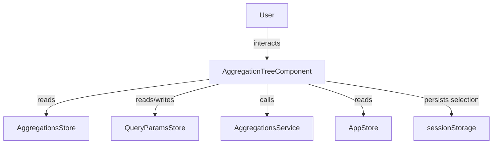
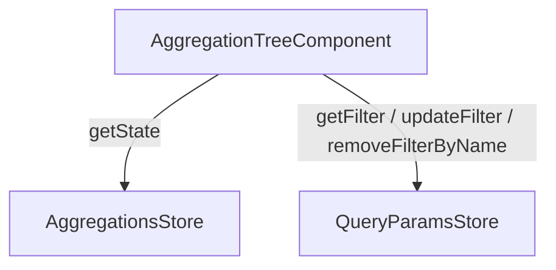

The `AggregationTreeComponent` displays a hierarchical tree of aggregation nodes. Users can expand and collapse nodes, select multiple paths, and apply them as search filters.

## Features

- Multi-select tree with expand/collapse per node
- **Apply** button appears only when the selection differs from the last applied state
- Keyboard accessible: **Arrow keys** navigate, **Space** toggles a node, **Enter** applies the current selection
- Lazy loading: child nodes are fetched on demand when a node is expanded
- Auto-expand on load via `[expandedLevel]`
- Live search / suggest: type to locate nodes within the tree
- Select all / Unselect all
- Load more: paginate through root-level nodes
- Session storage persistence: the visual selection is preserved across page navigations within the same session
- Multiple instances on the same page stay in sync automatically

## Usage

### Basic Example

```ts title="sample.component.ts"
import { AggregationTreeComponent } from "@sinequa/atomic-angular";

@Component({
  selector: "sample-component",
  imports: [AggregationTreeComponent],
  template: `
    <AggregationTree
      name="Treepath"
      column="treepath"
      [expandedLevel]="2"
      [collapsible]="true"
      [showFiltersCount]="true"
      (onApply)="onFiltersApplied()" />
  `,
})
export class SampleComponent {
  onFiltersApplied() { /* triggered after each apply */ }
}
```

### Selectors

```html
<AggregationTree ... />
<aggregation-tree ... />
<aggregationtree ... />
```

### Interaction model

| Action | Result |
|---|---|
| Click a node label | Toggles node selection |
| Click the folder / chevron button | Expands or collapses children *(does not affect selection)* |
| **Arrow keys** | Navigate between nodes |
| **Space** on a focused node | Toggles node selection |
| **Enter** on a focused node *(Apply visible)* | Applies the current selection |
| **Enter** on a focused node *(Apply not visible)* | Toggles node selection |
| Click **Apply** | Applies all selected nodes as filters |
| Click **Clear** | Removes all active filters for this aggregation |
| Click **Select all** | Selects all nodes with at least one result |
| Click **Unselect all** | Deselects all nodes |
| Click **Load more** | Fetches the next page of root-level nodes |

## API Reference

### Inputs

| Name | Type | Default | Description |
|---|---|---|---|
| `name*` | `string \| null` | *(required)* | Name of the tree aggregation as defined in the search configuration. |
| `column*` | `string \| null` | *(required)* | Column name associated with the aggregation (e.g. `treepath`). |
| `id` | `string \| null` | `null` | HTML id forwarded to the panel header. |
| `class` | `string` | `""` | Additional CSS classes applied to the host element. |
| `collapsible` | `boolean` | `false` | Whether the panel can be collapsed by clicking the header. |
| `collapsed` | `boolean` | `false` | Initial collapsed state (only when `collapsible` is `true`). |
| `searchable` | `boolean \| undefined` | `undefined` | Overrides the aggregation's own `searchable` flag. When `undefined`, the aggregation configuration is used. |
| `showFiltersCount` | `boolean` | `false` | Shows a badge in the panel header with the number of active filters. |
| `expandedLevel` | `number \| undefined` | `undefined` | Automatically expands nodes up to this depth on load. Overrides the aggregation's own `expandedLevel`. `1` expands root nodes, `2` expands root and first-level children, etc. |

### Outputs

| Name | Payload | Description |
|---|---|---|
| `onSelect` | `AggregationItem[]` | Emitted when a node is selected or deselected. Carries the list of currently selected nodes. |
| `onApply` | `void` | Emitted when the user applies the current selection. |
| `onClear` | `void` | Emitted when the user clears all active filters. |

### CSS Custom Properties

| Property | Default | Description |
|---|---|---|
| `--scroll-height` | `20rem` | Maximum height of the scrollable item area. Accepts any valid CSS length (`px`, `rem`, `vh`, etc.). |

```html
<!-- inline style -->
<AggregationTree style="--scroll-height: 400px" ... />

<!-- Tailwind v4 arbitrary property -->
<AggregationTree class="[--scroll-height:400px]" ... />

<!-- Tailwind v4 with responsive variant -->
<AggregationTree class="[--scroll-height:20rem] lg:[--scroll-height:40rem]" ... />
```

### Feature flags *(from `AppStore`)*

| Feature | Effect |
|---|---|
| `showAggregationItemCount` | Shows the result count next to each node. |
| `filterLinkChildren` | When a parent node is selected, its children are visually highlighted to indicate they are implicitly included in the filter. |

## Schemas

### Component Interaction



### Store Interaction



## Notes

- Use `AggregationTree` for **tree** aggregations only (`isTree: true`). If the aggregation is flat, use [`AggregationList`](aggregation-list.md) instead — an error will be displayed otherwise.
- Filters are stored as `in` operators with values formatted as `/path/*` (e.g. `/Root/Documents/*`).
- Session storage is keyed by column name (`agg-<column>`). It is cleared automatically when a new search runs or when the component is destroyed.
- When multiple instances of the same aggregation coexist on the page, all instances stay in sync: applying a filter from one instance is immediately reflected in all others.
