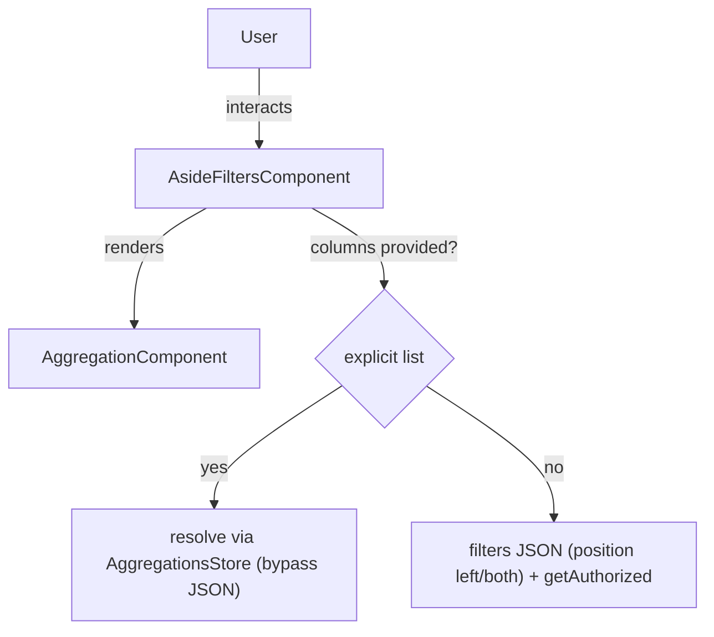
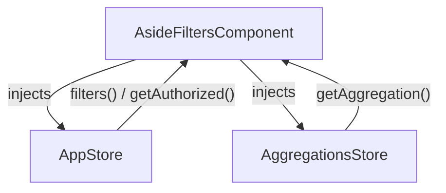

The `AsideFiltersComponent` displays a list of aggregations as collapsible
accordion sections — the "Facets List" pattern. It can be driven either by the application's
JSON `filters` configuration, or by an **explicit, finite list of aggregations** passed by the
developer, making it usable standalone (without the [filters bar](filters-bar.md)).

## Features

- Renders a vertical list of aggregations in accordion mode
- Two data sources:
  - **JSON-driven (default):** filters flagged `position: 'left' | 'both'` in the `filters` custom JSON
  - **Explicit list:** a developer-provided list of aggregation names/columns, fully decoupled from the JSON
- Configurable accordion behavior: a single open section at a time, or independent sections

## Usages

### JSON-driven (default)

Without `aggregations`, the component keeps the configured filters whose `position` is `left` or `both`
and intersects them with the authorized aggregations.

```ts title="sample.component.ts"
import { AsideFiltersComponent } from "@sinequa/atomic-angular";

@Component({
  selector: "sample-component",
  imports: [AsideFiltersComponent],
  template: `
    <aside-filters />
  `,
})
export class SampleComponent {}
```

### Explicit, finite list (standalone "Facets List")

Provide `aggregations` to render exactly the listed aggregations, in order, **bypassing the JSON
configuration entirely** (no `position`, no authorization filtering). Entries are resolved against
the `AggregationsStore`; unresolved entries are silently ignored.

```ts title="sample.component.ts"
import { AsideFiltersComponent } from "@sinequa/atomic-angular";

@Component({
  selector: "sample-component",
  imports: [AsideFiltersComponent],
  template: `
    <!-- prefer aggregation names: a column can be shared by several aggregations -->
    <aside-filters [aggregations]="['Authors', 'Sources', 'Geo']" />

    <!-- let several facets stay open at once -->
    <aside-filters [aggregations]="['Authors', 'Sources']" [exclusive]="false" />
  `,
})
export class SampleComponent {}
```

## API Reference

### Inputs

| Name        | Type                         | Default     | Description                                                                                                                                                                                                 |
|-------------|------------------------------|-------------|-------------------------------------------------------------------------------------------------------------------------------------------------------------------------------------------------------------|
| `aggregations`   | `string[]`                   | `[]`        | Explicit list of aggregations to display, by **name** (preferred) or column. When provided, it bypasses the JSON `filters` config and renders the listed aggregations as-is, in order. Empty ⇒ JSON-driven. |
| `exclusive` | `boolean`                    | `true`      | `true`: all sections share one `id` (native `<details name>` accordion, a single section open at a time). `false`: each section gets a unique id (per aggregation name) and expands independently.            |
| `class`     | `string`                     | `undefined` | Extra CSS classes applied to the host.                                                                                                                                                                       |

### Resolution

When `aggregations` is provided, each entry is resolved against the `AggregationsStore`:
`getAggregation(key, "name")` first (deterministic — `name` is the canonical identifier), then
`getAggregation(key, "column")` as a fallback. Because a column may be shared by several
aggregations, **prefer passing names** to target unambiguously.

## Schemas

### Component Interaction



### Store Interaction



## Notes

- The explicit `aggregations` mode is the recommended way to build a standalone facets list decoupled from the filters bar and the JSON configuration.
- Without `aggregations`, behavior is unchanged: the component remains driven by the `filters` custom JSON (`position: 'left' | 'both'`).
- The unique accordion id (when `exclusive` is `false`) is derived from the aggregation **name**, not its column, since a column can be shared by several aggregations.
