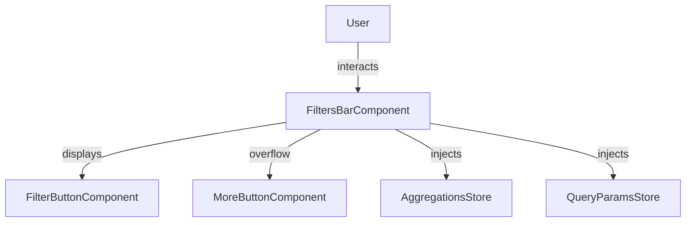
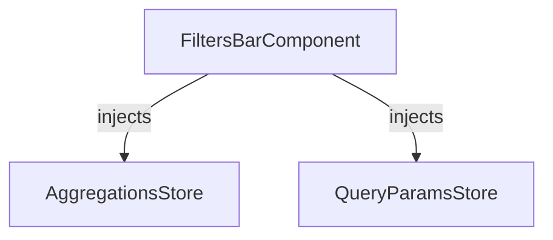

import useBaseUrl from '@docusaurus/useBaseUrl';

The `FiltersBarComponent` displays all active filters as buttons, provides clear-all and basket management, and handles [overflow](../../directives/overflow-manager.md).
It acts as the main UI for interacting with applied filters.

## Features

- Displays all active [filters](filter-button.md) as buttons
- Supports clearing all filters or basket
- Integrates with aggregations and advanced filters
- Handles overflow with a ["More" button](more.md) for additional filters

## Usages

### Basic Example

```ts title="sample.component.ts"
import { FiltersBarComponent } from "@angular/atomic-angular";

@Component({
    selector: "sample-component",
    imports: [FiltersBarComponent],
    template: `
    <filters-bar />
    `,
})
export class SampleComponent {}
```


### Advanced Example with Customization

```ts title="sample.component.ts"
import { FiltersBarComponent } from "@angular/atomic-angular";
@Component({
    selector: "sample-component",
    imports: [FiltersBarComponent],
    template: `
    <filters-bar
        direction="vertical"
        position="right"
        [excludeFilters]="['Sources']"
        [filtersCount]="9"
    />
    `,
})
export class SampleComponent {}
```


## API Reference

### Inputs

| Name                    | Type                         | Description                                                             |
|-------------------------|------------------------------|-------------------------------------------------------------------------|
| `direction`             | `horizontal` \| `vertical`   | Direction of the filter bar (default: `horizontal`).                    |
| `position`              | `Placement`                  | Position of the dropdown filters (default: `bottom-start`).             |
| `includeFilters`        | `string[]`                   | List of filter names that should only be displayed (default: `[]`).     |
| `excludeFilters`        | `string[]`                   | List of filter names to exclude from the bar (default: `[]`).           |
| `aggregations`          | `Aggregation[]`              | List of filter names to include in the bar (default: `undefined`).      |
| `filtersCount`          | `number`                     | Maximum number of filters to display before overflow (default: `5`).    |
| `showMoreFiltersButton` | `boolean`                    | Whether to show the "More Filters" button (default: `true`).            |

`filtersCount` can be customized using the Angular Injection Token: `FILTERS_BREAKPOINT`.  
This allows you to define how many filters should be displayed before the "More" button appears.

### Methods

| Method           | Description                                                        |
|------------------|--------------------------------------------------------------------|
| `clearFilters()` | Removes all active filters from the filter bar. Use this to reset the filter state. |
| `clearBasket()`  | Empties the basket, removing all selected items.                   |

### Outputs

| Event            | Description                                                        |
|------------------|--------------------------------------------------------------------|
| `onClearFilters` | Emitted when all filters are cleared.                              |
| `onClearBasket`  | Emitted when the basket is cleared.                                |

## Schemas

### Component Interaction



### Store Interaction



## Notes

- The filters bar is highly modular and can be used independently or with other filter components.
- All filter state is managed via stores (`AggregationsStore`, `QueryParamsStore`, etc.), ensuring consistency across the UI.
