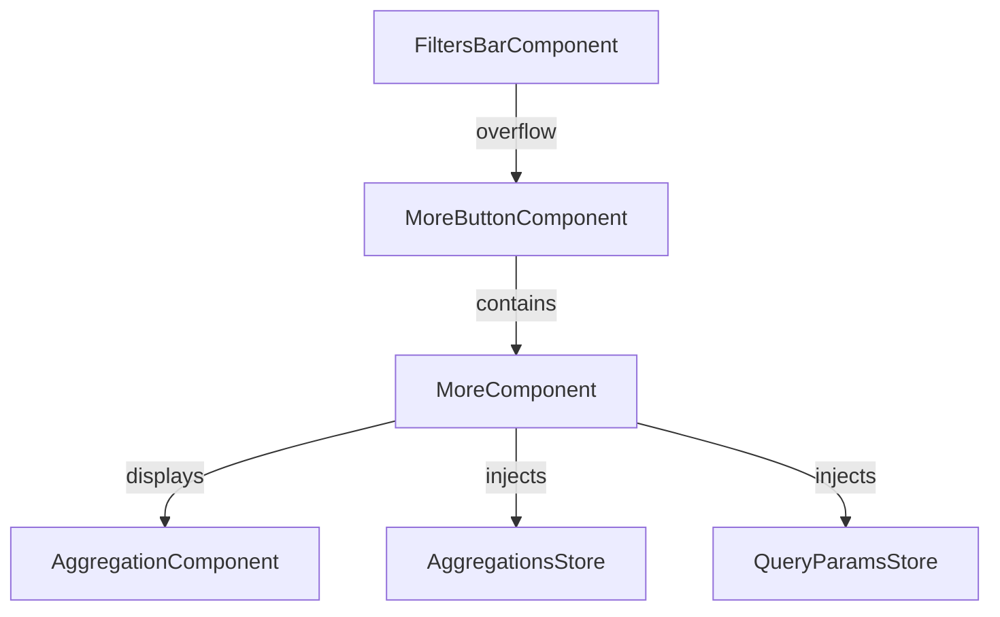
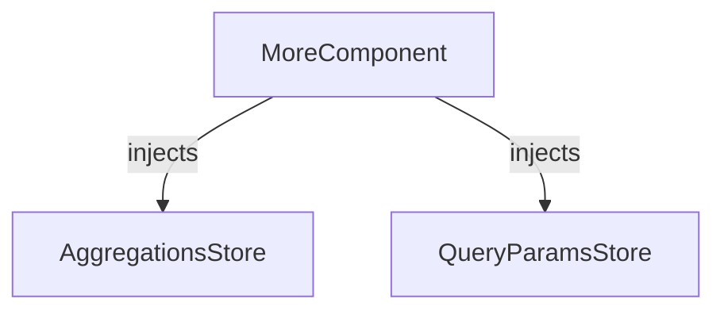

import useBaseUrl from '@docusaurus/useBaseUrl';

The `MoreButtonComponent` handles overflowed filters and provides access to additional filter controls.
It is used by the `FiltersBarComponent` when there are more filters than can be displayed in the available space.

## Features

- Displays overflowed filters in a dropdown or expandable area
- Integrates with aggregations and filter state
- Provides access to additional filter actions

## Usage

### Basic Example

```ts title="sample.component.ts"
import { MoreButtonComponent } from "@angular/atomic-angular";

@Component({
    selector: "sample-component",
    imports: [MoreButtonComponent],
    template: `
    <more-button />
    `,
})
export class SampleComponent {}
```


## API Reference

### Inputs

| Name          | Type     | Description                                         |
|---------------|----------|-----------------------------------------------------|
| `count` | `number` | Number of filters contained in the dropdown |
| `position`    | `Placement` | Position of the dropdown (default: `bottom-end`) |
| `includedFilters` | `string[]` | Filters to only be included in the dropdown |
| `excludedFilters` | `string[]` | Filters to exclude from the dropdown |

## Schemas

### Component Interaction



### Store Interaction



## Notes

- The `MoreComponent` is automatically used by the filters bar when needed.
- It ensures all filters remain accessible, even when space is limited.
