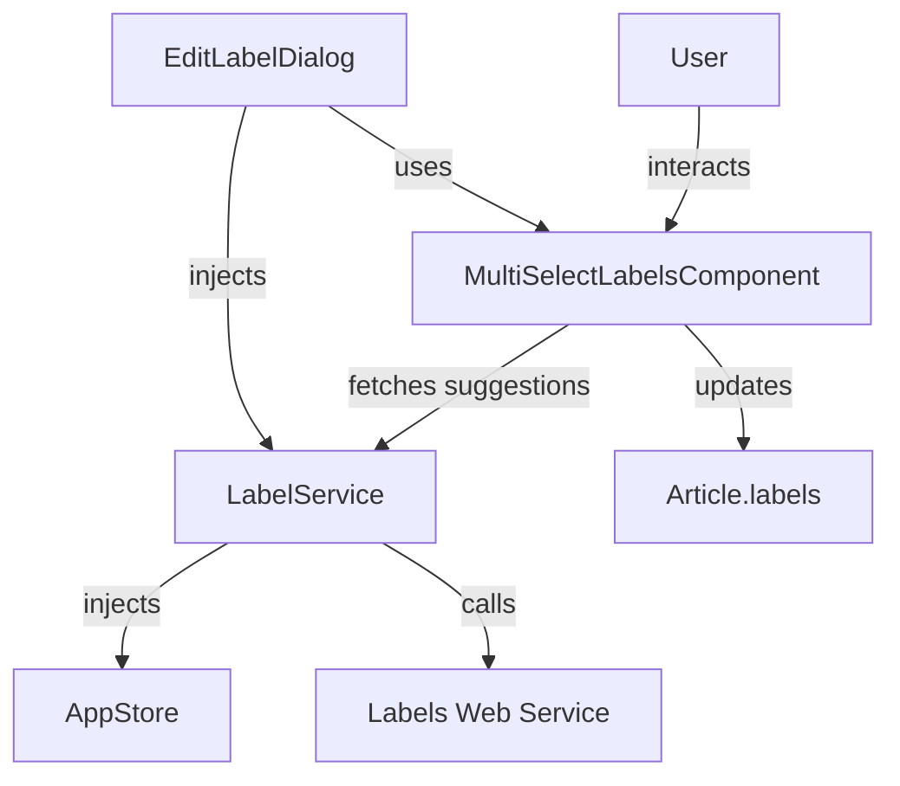
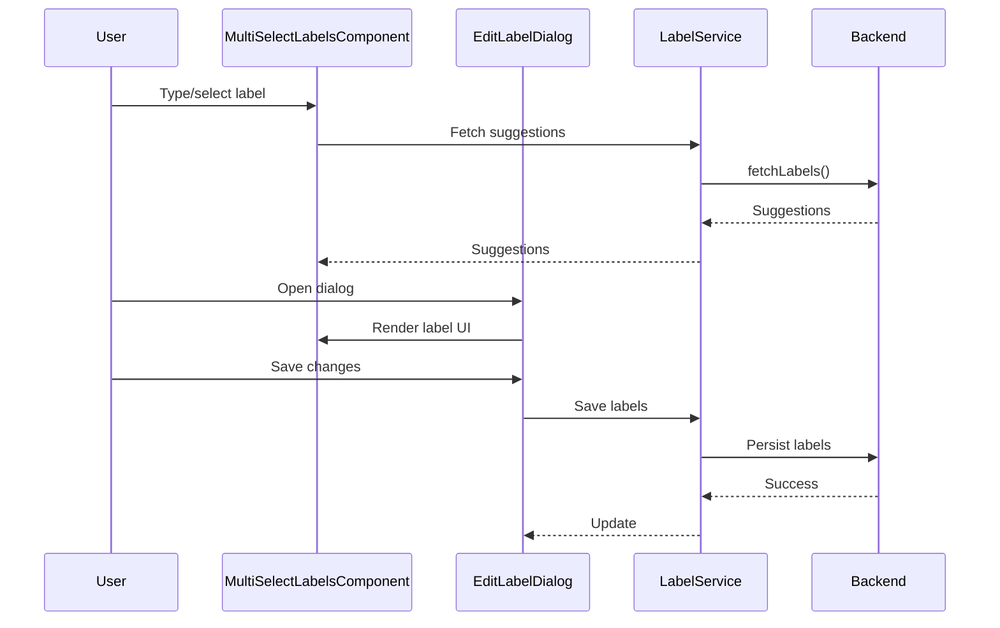

The `labels` feature provides a flexible system for adding, editing, and managing labels (tags) on articles or items in your Angular application. It supports both public and private labels, label suggestions, and integrates with backend services for persistence and access control.

## Overview

The labels system is composed of several key parts:

- **MultiSelectLabelsComponent**: UI for adding/removing multiple labels with suggestions and keyboard support.
- **LabelService**: Handles label operations, user rights, and backend integration.
- **EditLabelDialog**: Dialog for editing labels on an article, supporting both public and private labels.
- **i18n**: Internationalization support for label UI strings.

## Usage Example

```ts
import { MultiSelectLabelsComponent } from '@sinequa/atomic-angular';

@Component({
  selector: 'my-component',
  template: `
    <multiselect-labels [(article)]="article" [labelsField]="'publicLabels'" />
  `,
  imports: [MultiSelectLabelsComponent]
})
export class MyComponent {
  article = { /* ... */ };
}
```

## Features

- Add, remove, and suggest labels (public/private)
- Keyboard and mouse support for label entry
- Dialog for editing labels on an article
- Access control for label editing (via LabelService)
- i18n support for UI strings

## Component & Service Schema



## Label Editing Process



## Internationalization (i18n)

Label UI strings are available in multiple languages (e.g., English, French) and can be extended via the i18n files in the `labels/i18n/` folder.

## Notes

- Access to label editing can be restricted based on user rights (see `LabelService.canHandleLabels()`)
- The system supports both public and private labels, configurable via the backend and `LabelsConfig`.
- Dialogs and components are fully standalone and can be integrated as needed.
