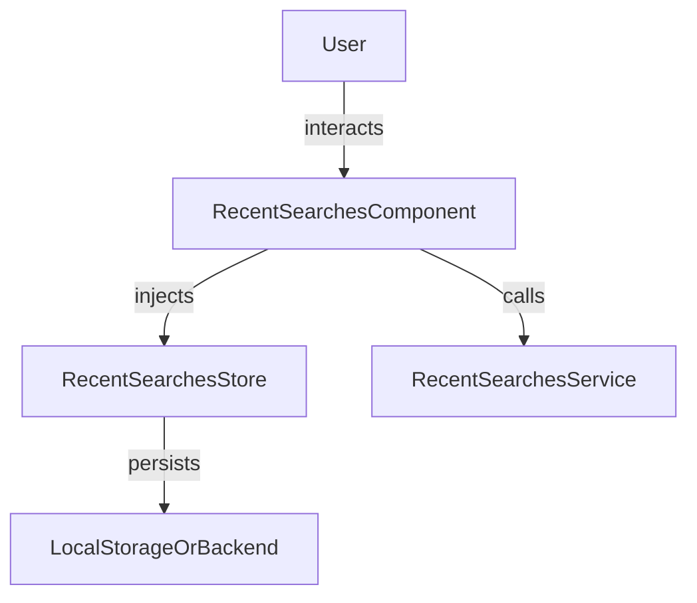

The `RecentSearches` feature provides a UI and logic for displaying and managing a user's recent search queries. It helps users quickly revisit previous searches and improves search experience.

## Usage

```ts title="sample.component.ts"
import { RecentSearchesComponent } from "@sinequa/atomic-angular";

@Component({
    selector: "sample-component",
    imports: [RecentSearchesComponent],
    template: `
    <recent-searches />
    `,
})
export class SampleComponent {
    // The component automatically loads and displays recent searches
}
```

### Properties

| Property         | Type                           | Description                                 |
|-----------------|--------------------------------|---------------------------------------------|
| `recentSearches`| `Observable<SearchQuery[]>`    | List of recent search queries               |
| `loading`       | `boolean`                      | Whether recent searches are being loaded    |
| `error`         | `string \| null`                | Error message if loading fails              |

### Methods

| Method                | Description                                 |
|----------------------|---------------------------------------------|
| `selectSearch(query)`| Re-executes a previous search               |
| `clearRecent()`      | Clears all recent searches                  |

### Features

- Displays a list of recent search queries
- Allows re-executing or removing individual searches
- Option to clear all recent searches
- Integrates with search and navigation services

## Visual Schema



## Notes

- Recent searches are typically stored locally for privacy and speed.
- The component can be used in search bars, dropdowns, or as a standalone list.
