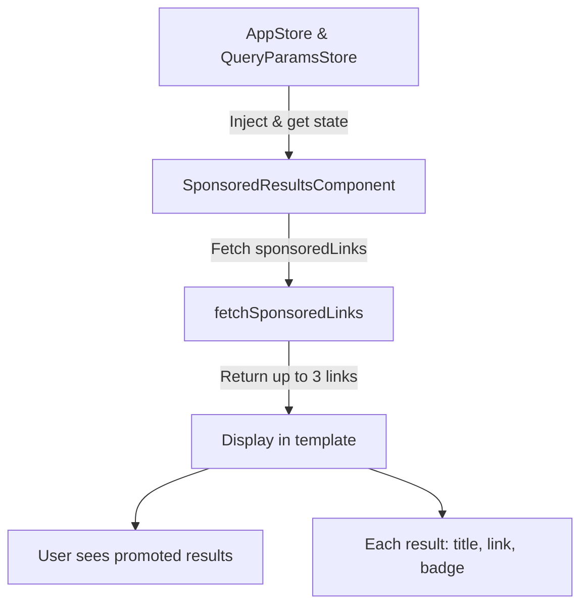

The `SponsoredResultsComponent` displays a list of sponsored links (promoted results) relevant to the current search query. It fetches and shows up to three sponsored results, each with a title, link, and a "PROMOTED" badge.

## Features

- Fetches sponsored links based on the current query
- Displays up to three sponsored results
- Each result includes a title, external link icon, and a promoted badge
- Fully standalone and accessible (uses ARIA roles)

## Usage

```html
<sponsored-results></sponsored-results>
```

## Inputs

- `slice`: Number of sponsored results to display (default is 3).
- `displayPromoted`: Boolean to control the visibility of the "PROMOTED" badge (default is true).

### Example Basic Usage

```html
<sponsored-results></sponsored-results>
```

### Example with Custom Promoted Badge

```html
<sponsored-results>
  <span *childMarker class="custom-promoted-badge">Custom PROMOTED</span>
</sponsored-results>
```

### Example with Custom Slice

```html
<sponsored-results slice=5 />
```

## Notes

- The component uses the application's sponsored links configuration and the current query to fetch results.
- The promoted badge appears on hover for accessibility and clarity.

## Schema



- The component injects AppStore and QueryParamsStore to access app state and current query.
- It computes the sponsored links and fetches up to three relevant results.
- Results are displayed as a list, each with a title, external link, and a "PROMOTED" badge.
