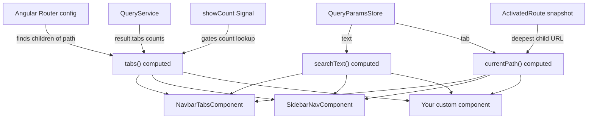

`injectRouteNavigation` is a composable function that extracts route-based navigation state from the Angular router and exposes it as reactive signals. It powers both `NavbarTabsComponent` and `SidebarNavComponent`, and can be used to build any custom navigation component without duplicating logic.

## What it returns

```ts
const nav = injectRouteNavigation(path, showCount);

nav.tabs()        // NavRouteTab[] — all tabs derived from router config
nav.currentPath() // string       — active child route path
nav.searchText()  // string       — current search query from the store
```

Each property is a computed signal — they update automatically when the route, the store, or the `path` input changes.

## API reference

### Signature

```ts
function injectRouteNavigation(
  path: Signal<string>,
  showCount: Signal<boolean>
): {
  tabs: Signal<NavRouteTab[]>;
  currentPath: Signal<string>;
  searchText: Signal<string>;
}
```

### Parameters

| Parameter   | Type              | Description                                                             |
|-------------|-------------------|-------------------------------------------------------------------------|
| `path`      | `Signal<string>`  | The base route path to read children from (e.g. `"search"`).           |
| `showCount` | `Signal<boolean>` | Whether to populate `count` on each tab from the last query result.     |

### `NavRouteTab`

| Property     | Type               | Description                                              |
|--------------|--------------------|----------------------------------------------------------|
| `display`    | `string`           | Label, from `route.data.display` or the path segment.   |
| `wsQueryTab` | `string`           | Sinequa query tab name, from `route.data.wsQueryTab`.   |
| `path`       | `string`           | The child route path segment.                            |
| `routerLink` | `string`           | Full absolute link (e.g. `"/search/documents"`).        |
| `icon`       | `string`           | Font Awesome class string, from `route.data.icon`.      |
| `queryName`  | `string?`          | Optional query name, from `route.data.queryName`.       |
| `count`      | `number?`          | Result count from the last query (when `showCount`).    |

## Usage

### With an existing component

Both `NavbarTabsComponent` and `SidebarNavComponent` are ready-made consumers. If one of them fits your layout, use it directly:

```ts title="search-shell.component.ts"
import { NavbarTabsComponent } from "@sinequa/atomic-angular";
import { SidebarNavComponent } from "@sinequa/atomic-angular";

@Component({
  imports: [NavbarTabsComponent, SidebarNavComponent],
  template: `
    <!-- Horizontal tabs with overflow menu -->
    <navbar-tabs path="search" />

    <!-- Sidebar menu items -->
    <sidebar-nav path="search" />
  `
})
export class SearchShellComponent {}
```

### With a custom component

Import `injectRouteNavigation` directly to build your own navigation UI:

```ts title="my-nav.component.ts"
import { Component, input, booleanAttribute } from "@angular/core";
import { RouterLink } from "@angular/router";
import { injectRouteNavigation } from "@sinequa/atomic-angular";

@Component({
  selector: "my-nav",
  standalone: true,
  imports: [RouterLink],
  template: `
    <nav>
      @for (tab of nav.tabs(); track tab.path) {
        <a
          [routerLink]="[tab.routerLink]"
          [class.active]="nav.currentPath() === tab.path">
          {{ tab.display }}
        </a>
      }
    </nav>
  `
})
export class MyNavComponent {
  readonly path      = input("search");
  readonly showCount = input(false, { transform: booleanAttribute });

  readonly nav = injectRouteNavigation(this.path, this.showCount);
}
```

:::info
`input()` returns a `Signal<T>` in Angular 17+, so it can be passed directly to `injectRouteNavigation` without any wrapping.
:::

## Route configuration

The composable reads its tabs from the Angular router. Each child route under the `path` must declare its display data:

```ts title="app.routes.ts"
{
  path: "search",
  loadComponent: () => import("./search-shell.component"),
  children: [
    {
      path: "all",
      loadComponent: () => import("./all-results.component"),
      data: {
        display:    "All",        // Tab label
        wsQueryTab: "all",        // Sinequa query tab
        icon:       "far fa-globe" // Font Awesome class (optional)
      }
    },
    {
      path: "documents",
      loadComponent: () => import("./documents.component"),
      data: {
        display:    "Documents",
        wsQueryTab: "documents",
        icon:       "far fa-file-alt",
        queryName:  "documents-query" // optional: scopes the result count
      }
    },
    { path: "", redirectTo: "all", pathMatch: "full" },
    { path: "**",  redirectTo: "all" }
  ]
}
```

:::warning
Routes with `path: "**"` are automatically excluded from the tab list. Redirects (`redirectTo`) are also filtered out since they have no `data` and no meaningful path.
:::

## Architecture



## Writing your own inject function

If `injectRouteNavigation` does not cover your use case, you can write your own composable following the same pattern.

### Rules

1. **Name it `inject*`** — the Angular community convention signals that the function uses `inject()` internally.
2. **Accept `Signal<T>` parameters** — never accept raw values. This keeps the function reactive when inputs change.
3. **Call it at field-initialization time** — `inject()` is only valid during the component's construction phase (field initializers and constructor body).
4. **Return only signals and functions** — no subscriptions, no side effects in the return value.

### Template

```ts title="inject-my-feature.ts"
import { computed, inject, Signal } from "@angular/core";
import { MyService } from "./my.service";

export function injectMyFeature(param: Signal<string>) {
  // 1. Inject dependencies — valid here because we're in injection context
  const service = inject(MyService);

  // 2. Derive reactive state with computed()
  const items = computed(() => service.getItems(param()));
  const selected = computed(() => items().find(i => i.active));

  // 3. Expose plain functions for imperative actions
  function select(id: string) {
    service.select(id);
  }

  // 4. Return signals and functions — no classes, no subjects
  return { items, selected, select };
}
```

```ts title="my-component.ts"
@Component({ ... })
export class MyComponent {
  readonly param = input("default");

  // Called during field initialization — injection context is active
  readonly feature = injectMyFeature(this.param);
}
```

### What not to put inside

| Avoid | Reason |
|---|---|
| `signal()` for display-only state | Keep display-specific signals (e.g. overflow count) in the component itself. |
| Template/rendering concerns | The function must be layout-agnostic so multiple components can reuse it. |
| `new Subject()` / RxJS subscriptions | Signals are the primitive here; mixing RxJS adds teardown complexity. |
| Shared mutable state across instances | Each call creates independent signal instances. Use a service or store for shared state. |

### When to use a service instead

Use a `@Injectable()` service rather than an inject function when:

- **State must be shared** between two sibling components (e.g. a navbar and a sidebar both reflecting the same selection, synchronized).
- **You need `providedIn`-scoped lifecycle** (root, component, or route).
- **The logic depends on runtime configuration** passed after construction (e.g. set via a method call, not an input).

:::note
An inject function and a service are not mutually exclusive. An inject function can itself inject a service and expose a computed view over it — that is exactly what `injectRouteNavigation` does with `QueryParamsStore` and `QueryService`.
:::

## Examples

### Mobile bottom navigation

```ts title="bottom-nav.component.ts"
@Component({
  selector: "bottom-nav",
  standalone: true,
  imports: [RouterLink, FaIconComponent],
  template: `
    <nav class="fixed bottom-0 flex w-full justify-around border-t bg-white">
      @for (tab of nav.tabs(); track tab.path) {
        <a
          [routerLink]="[tab.routerLink]"
          [queryParams]="{ t: tab.wsQueryTab, q: nav.searchText() }"
          class="flex flex-col items-center p-2 text-xs"
          [class.text-primary]="nav.currentPath() === tab.path">
          <FaIcon [faClass]="tab.icon" />
          <span>{{ tab.display }}</span>
        </a>
      }
    </nav>
  `
})
export class BottomNavComponent {
  readonly path = input("search");
  readonly nav  = injectRouteNavigation(this.path, signal(false));
}
```

### Select dropdown navigation

```ts title="tab-select.component.ts"
@Component({
  selector: "tab-select",
  standalone: true,
  imports: [FormsModule],
  template: `
    <select [ngModel]="nav.currentPath()" (ngModelChange)="navigate($event)">
      @for (tab of nav.tabs(); track tab.path) {
        <option [value]="tab.path">{{ tab.display }}</option>
      }
    </select>
  `
})
export class TabSelectComponent {
  readonly path   = input("search");
  readonly router = inject(Router);
  readonly nav    = injectRouteNavigation(this.path, signal(false));

  navigate(path: string) {
    const tab = this.nav.tabs().find(t => t.path === path);
    if (tab) this.router.navigateByUrl(tab.routerLink);
  }
}
```
