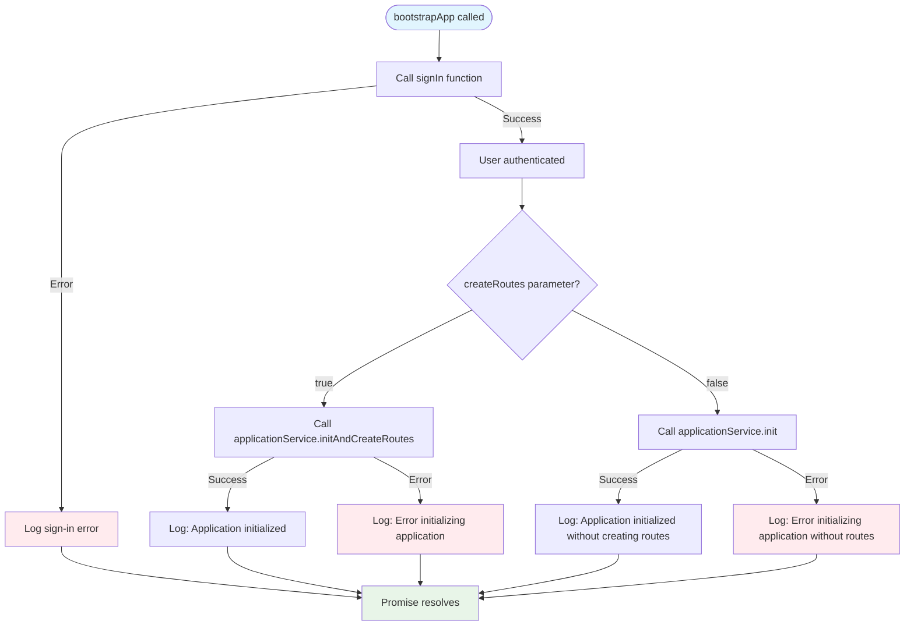
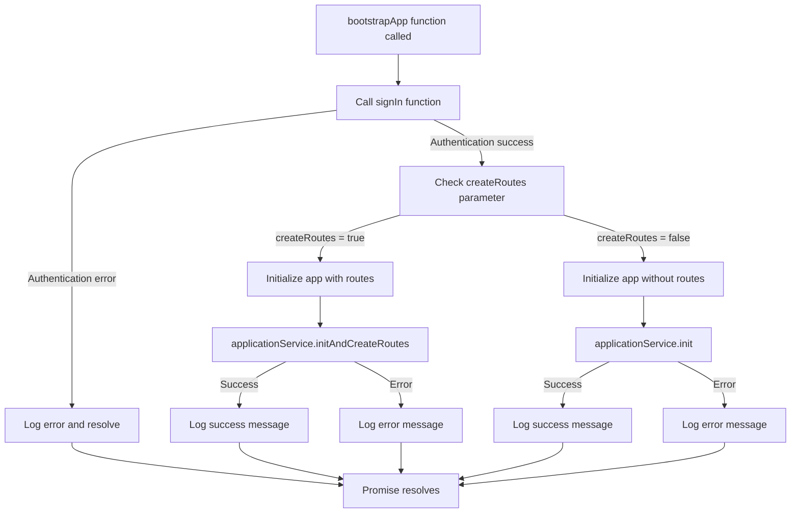
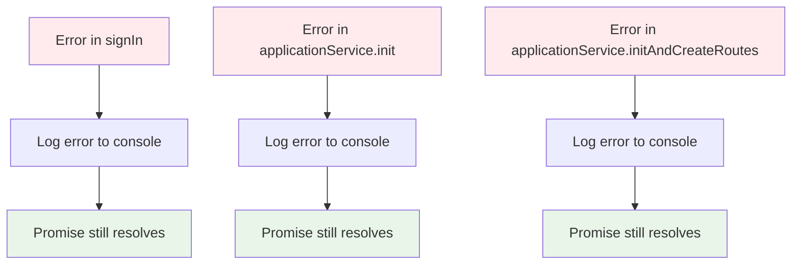

## bootstrapApp()

The `bootstrapApp` function is responsible for bootstrapping the application by ensuring the user is authenticated and initializing the application. It provides a robust initialization process with comprehensive error handling.

### Parameters

| Parameter           | Type                  | Description                                                   |
|--------------------|-----------------------|---------------------------------------------------------------|
| `applicationService` | `ApplicationService` | The service responsible for initializing the application and creating routes |
| `options`          | `object`             | Configuration options for the bootstrap process              |
| `options.createRoutes` | `boolean`        | Whether to create routes during initialization (default: `true`) |

### Return Value

| Type            | Description                                                   |
|-----------------|---------------------------------------------------------------|
| `Promise<void>` | A promise that resolves when the application is ready to be initialized, regardless of success or failure |

### Complete Flow Diagram



### Bootstrap Flow



### Error Handling Flow



### Usage

```ts title="app.config.ts"
export const appConfig: ApplicationConfig = {
  providers: [
    provideAppInitializer(() => {
      const applicationService = inject(ApplicationService);
      return bootstrapApp(applicationService, { createRoutes: true });
    }),
    ...
  ]
}
```

### Alternative Usage Without Routes

```ts title="app.config.ts"
export const appConfig: ApplicationConfig = {
  providers: [
    provideAppInitializer(() => {
      const applicationService = inject(ApplicationService);
      return bootstrapApp(applicationService, { createRoutes: false });
    }),
    ...
  ]
}
```

### Implementation Details

The function performs the following steps:

1. **Authentication Check**: Calls the `signIn()` function to ensure the user is authenticated
2. **Conditional Initialization**: Based on the `createRoutes` parameter:
   - If `true`: Calls `applicationService.initAndCreateRoutes()`
   - If `false`: Calls `applicationService.init()`
3. **Comprehensive Logging**: Provides detailed console logs for each step and outcome
4. **Error Resilience**: All errors are caught and logged, but the promise always resolves

### Key Features

- **Fail-Safe Design**: The function never rejects, ensuring the application can start even if some initialization steps fail
- **Flexible Route Creation**: Optional route creation based on configuration
- **Comprehensive Logging**: Detailed console output for debugging and monitoring
- **Sequential Execution**: Ensures authentication happens before application initialization

### Error Scenarios

- **Authentication Failure**: Logs error but continues with application startup
- **Application Initialization Failure**: Logs error but allows the application to continue
- **Route Creation Failure**: Logs error but allows the application to continue

### Dependencies

The function depends on:

- `signIn()` utility function for authentication
- `ApplicationService` for application initialization
- Console logging for error tracking and debugging

### Best Practices

1. **Use in App Initializer**: This function is designed to be used with Angular's `APP_INITIALIZER` token
2. **Monitor Console Logs**: Pay attention to console output for initialization status
3. **Handle Route Creation**: Choose the appropriate `createRoutes` setting based on your application needs
4. **Error Monitoring**: Consider implementing additional error tracking for production environments
