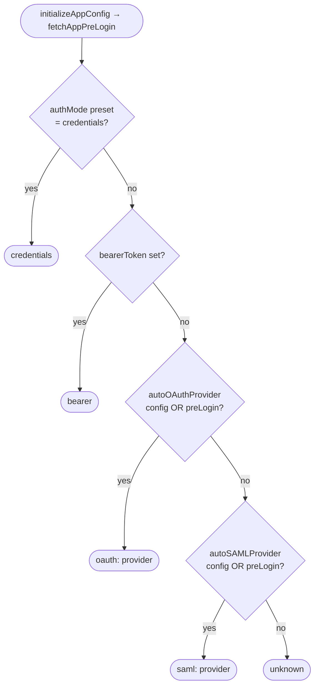
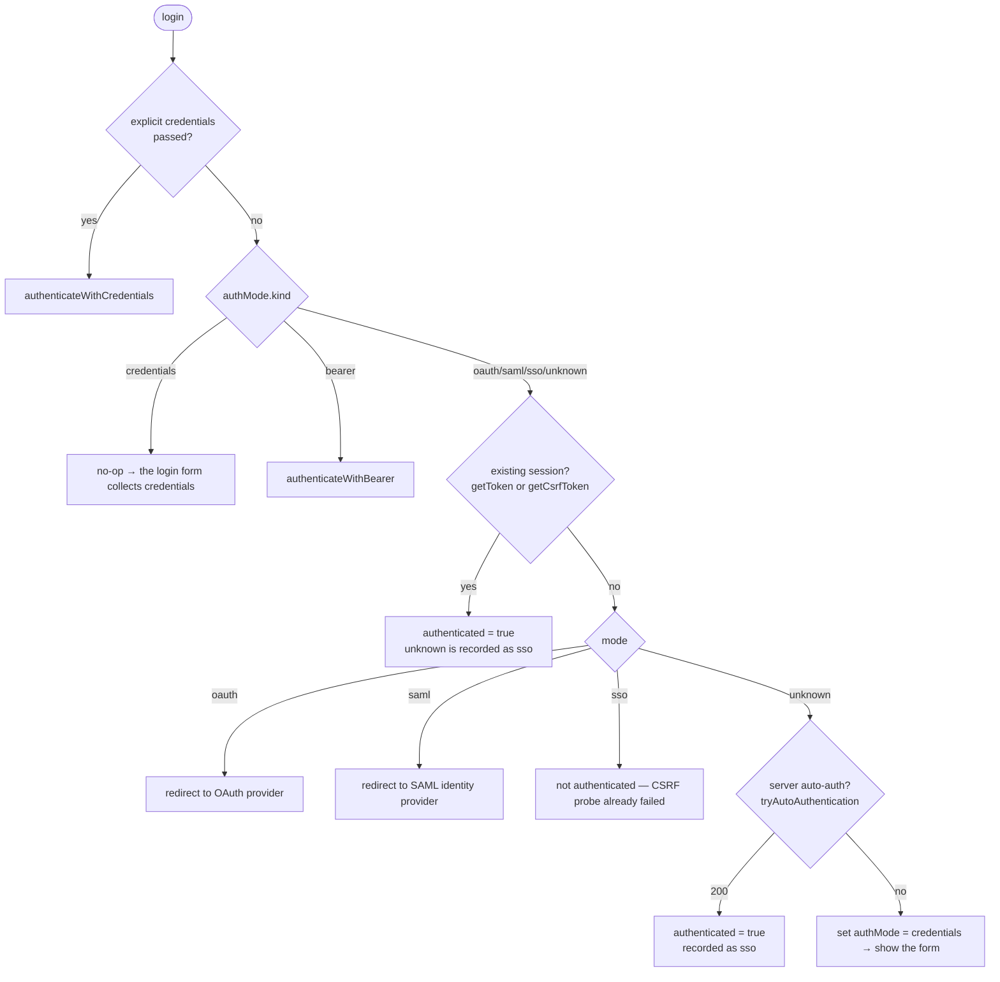
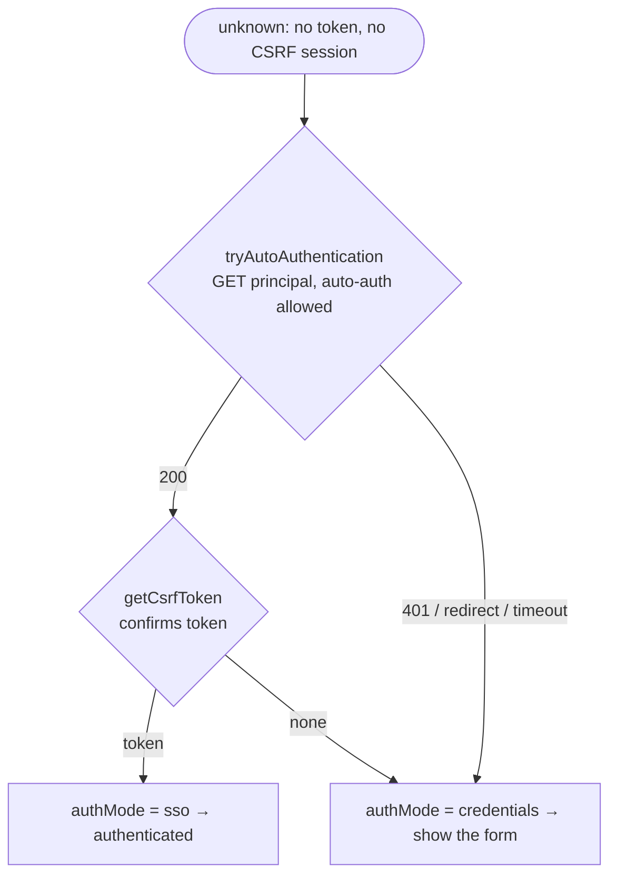
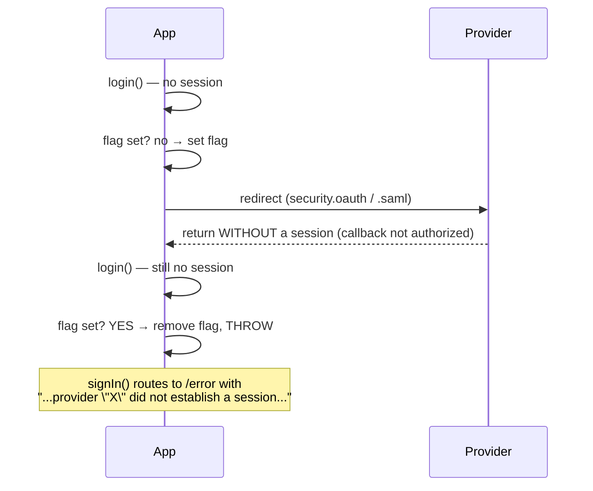

# Authentication flows

This page maps every authentication flow the library supports and **how each one is handled** end to
end. It is the runtime companion to [`AuthMode`](./auth-mode.md): `AuthMode` defines *what* the mode
is, this page describes *what happens* for each mode.

All flows go through the same two stages:

1. **Detection** — `initializeAppConfig()` queries the server pre-login and calls
   `detectAuthMode(config, preLogin)` to resolve `globalConfig.authMode`. Pure, server-authoritative.
2. **Resolution** — `login()` acts on the resolved mode, always **checking for an existing session
   first** before running any mode-specific handshake.

## Detection — choosing the mode

`detectAuthMode` is a pure function with a fixed precedence:

```
credentials preset > bearer token > OAuth provider > SAML provider > unknown
```



> Config-provided providers take precedence over server-provided ones
> (`config.autoOAuthProvider || preLogin?.autoOAuthProvider`); when the environment defines none — the
> common case — the backend stays authoritative. OAuth wins over SAML when both are present.

## Resolution — `login()` per mode

`login()` runs once the mode is known. The shared rule for every non-credentials, non-bearer mode:
**an existing session short-circuits the handshake**.



| Mode | No session yet → handling |
| --- | --- |
| `credentials` | `login()` is a **no-op** (returns `false`); the credentials form drives `login({username,password})`. |
| `sso` | The session check **is** the SSO handshake (a successful `getCsrfToken()` covers proxy/browser SSO). If it failed, the user is not authenticated. |
| `oauth` | Redirect to the OAuth provider (`tryOAuthAuthentication`). |
| `saml` | Redirect to the SAML identity provider (`trySAMLAuthentication`). |
| `bearer` | Authenticate with the configured token (`getJWToken`). |
| `unknown` | Probe for **server-side auto-authentication** ([`tryAutoAuthentication`](./tryAutoAuthentication.md), e.g. OIDC) before anything else; a `200` is recorded as `sso`. Otherwise resolve to `credentials` so the form is shown (deterministic, no UI-side timeout). A successful CSRF session probe is also recorded as `sso`. |

Checking the session **before** any provider redirect is what prevents a re-bootstrap after a
successful OAuth/SAML sign-in from redirecting to the provider again (reload loop).

## OIDC / server-side auto-authentication (the `unknown` mode)

Some servers auto-authenticate the user (e.g. **OIDC** with an existing IdP session) **without**
advertising any provider in the pre-login response. The mode therefore resolves to `unknown`, and the
two cheap session probes (`getToken()`, then `getCsrfToken()`) both miss it:

- `getCsrfToken()` calls `…/challenge?action=getCsrfToken&suppressErrors=true` — `suppressErrors=true`
  makes the server answer `200` with no token when unauthenticated (it **never runs the auth
  challenge**), so `getCsrfToken()` returns `null` here rather than throwing;
- `fetchPrincipal()` sends `noAutoAuthentication=true`, which **explicitly disables** auto-auth.

So before falling back to the credentials form, `login()` runs
[`tryAutoAuthentication()`](./tryAutoAuthentication.md): a `GET api/v1/principal?action=get`
**without** `noAutoAuthentication` (and `redirect: "manual"`, so an auth redirect to the IdP surfaces
as a non-200 instead of a CORS network error). On `200` the server has established a session — typically
an HttpOnly cookie — which is **authoritative on its own**: `login()` records the mode as `sso` and
reports authenticated, even when no token is available client-side. It still calls `getCsrfToken()` once
more as a **best-effort** refresh (it primes `getToken()` where the challenge endpoint is available, and
returns `null` otherwise without blocking the session). On any non-200 the credentials fallback stands.



There is **no redirect loop**: the probe is a `fetch` (no browser navigation) and does not set the
`AUTH_REDIRECT_ATTEMPT_KEY` guard.

## Token expiry & silent re-authentication

Sessions use a **sliding refresh**: every response carrying a `sinequa-jwt-refresh` header re-stores
the token (`handleResponse` → `setToken`), so an **active** user is continuously extended and never
expires mid-use. Expiry only happens after idle time (or server-side revocation).

On the next API call after expiry the server answers `401`. `@sinequa/atomic` does not retry at the
HTTP layer (4xx are terminal in `withRetry`); the reaction is orchestrated by the consumer
(`@sinequa/atomic-angular`'s `errorInterceptorFn` → `signIn()`). For a user that was auto-authenticated
via OIDC (mode `sso`), `signIn()` reloads the page; the re-bootstrap resolves `unknown` again and
**re-runs `tryAutoAuthentication()`** — so a still-valid IdP session re-authenticates silently, and an
expired one cleanly falls back to the credentials form. See the
[atomic-angular auth flows](#see-also) for the full 401 → re-auth orchestration.

## Provider redirect loop guard (OAuth / SAML)

The session-first check stops the loop when the user **is** authenticated. A different loop happens
when the provider **never** establishes a session — e.g. the provider's callback is not authorized for
this application: each bootstrap redirects to the provider, returns unauthenticated, and redirects
again, forever.

`tryOAuthAuthentication` / `trySAMLAuthentication` guard against this with a one-shot
`sessionStorage` flag (`AUTH_REDIRECT_ATTEMPT_KEY`):



- The flag is **set right before** the first redirect.
- On the **second** consecutive return without a session, the helper **throws** a descriptive error
  (including the provider name) instead of redirecting again.
- The flag is **cleared** as soon as a session is established (in `login()`, on `getToken()` or
  `getCsrfToken()` success), so a later legitimate re-authentication is never falsely blocked.

## Impersonation (user override)

Impersonation is **header-driven**, not a separate login: while
`globalConfig.userOverrideActive` is set, `createHeaders` adds `sinequa-override-user` /
`sinequa-override-domain` to every request on top of the current (admin) session. Switching the
override therefore only requires **re-fetching** with the new headers, never a new `login()`.

One interaction with `login()`: `authenticateWithCredentials` temporarily **clears** the override
around `getJWToken` and **restores** it afterwards, so a credentials login always issues a cookie for
the real user — never the impersonated one.

## Error handling — surfacing the cause

Authentication/config requests use `handleResponse`, which converts the Sinequa error envelope into a
thrown `Error`/`ServerError` carrying its `errorMessage`. For example a bad `app` query parameter
returns **HTTP 500** with:

```json
{ "methodresult": "error", "errorCode": 4, "errorMessage": "app not found: 'my-app'" }
```

`handleResponse` throws `ServerError("app not found: 'my-app'")`. Consumers (e.g.
`@sinequa/atomic-angular`'s `bootstrapApp` / sign-in flow) read that message and route to their error
page — see the [atomic-angular auth flows](#see-also).

## See also

- [`AuthMode`](./auth-mode.md) — the typed model and backward-compatibility getters.
- [`login`](./login.md), [`tryOAuthAuthentication`](./tryOAuthAuthentication.md),
  [`trySAMLAuthentication`](./trySAMLAuthentication.md), [`getCsrfToken`](./getCsrfToken.md).
- `@sinequa/atomic-angular` → *Authentication flows* for the Angular orchestration (bootstrap, guard,
  interceptors, error page, override dialog).
