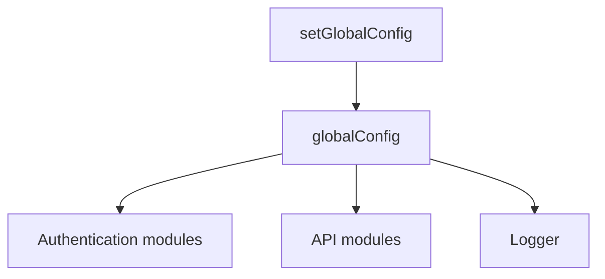

This module manages the global configuration settings required to connect to the Sinequa platform. It provides:

- A global configuration object with default values
- A function to merge custom settings into the global configuration
- Options to control authentication, user overrides, logging, and routing

## `globalConfig`

The global configuration object used by all modules (authentication, API calls, logging, etc.).

:::info Default values

```json
{
  "loginPath": "/login",
  "createRoutes": false
}
```

The `backendUrl` is automatically set to `window.location.origin` by [`appInitializerFn()`](../api/app#appinitializerfn) if not specified.
:::

**Type**

```typescript
type AppGlobalConfig<T extends Record<string, any> = {}> = {
  app: string;
  backendUrl: string;
  autoOAuthProvider: string;
  autoSAMLProvider: string;
  bearerToken: string;
  loginPath: string;
  userOverride: {
    username: string;
    domain: string;
  };
  userOverrideActive: boolean;
  useCredentials: boolean;   // when true, credentials are sent with requests
  useSSO: boolean;           // when true, SSO is used
  useSAML: boolean;          // when true, SAML is used even if OAuth is available
  logLevel: LogLevel;        // controls the application log level
  createRoutes: boolean;     // when true, the application creates routes (default: false)
} & T;
```

**Example**

```typescript title="read-global-config.ts"
import { globalConfig } from '@sinequa/atomic';

console.log(globalConfig.loginPath); // '/login'
console.log(globalConfig.app);       // undefined until set
```

## `setGlobalConfig()`

Merges a partial configuration object into the existing global configuration.

**Parameters**

| Parameter | Type | Required | Description |
|-----------|------|:--------:|-------------|
| `config` | `Partial<AppGlobalConfig>` | ✓ | Configuration properties to merge. Supports custom properties via generic type extension. |

**Returns** `void`

**Example**

```typescript title="set-global-config.ts"
import { globalConfig, setGlobalConfig } from '@sinequa/atomic';

setGlobalConfig({ app: 'training', logLevel: LogLevel.DEBUG });

console.log(globalConfig.app); // 'training'
```

---

## Configuration Schema



---

## Summary Table

| Property | Type | Default | Description |
|----------|------|---------|-------------|
| `app` | `string` | — | Sinequa application name |
| `backendUrl` | `string` | `window.location.origin` | URL of the backend server |
| `autoOAuthProvider` | `string` | — | Name of the OAuth provider |
| `autoSAMLProvider` | `string` | — | Name of the SAML provider |
| `bearerToken` | `string` | — | Bearer token for authentication |
| `loginPath` | `string` | `'/login'` | Login route path |
| `userOverride` | `{ username, domain }` | — | User override credentials |
| `userOverrideActive` | `boolean` | — | Whether user override is active |
| `useCredentials` | `boolean` | — | Send credentials with requests |
| `useSSO` | `boolean` | — | Use SSO for authentication |
| `useSAML` | `boolean` | — | Use SAML even if OAuth is available |
| `logLevel` | `LogLevel` | — | Application log level |
| `createRoutes` | `boolean` | `false` | Create routes for the application |

:::note
All properties are optional when calling `setGlobalConfig()`. The `AppGlobalConfig` type supports additional custom properties via its generic parameter `T`.
:::
