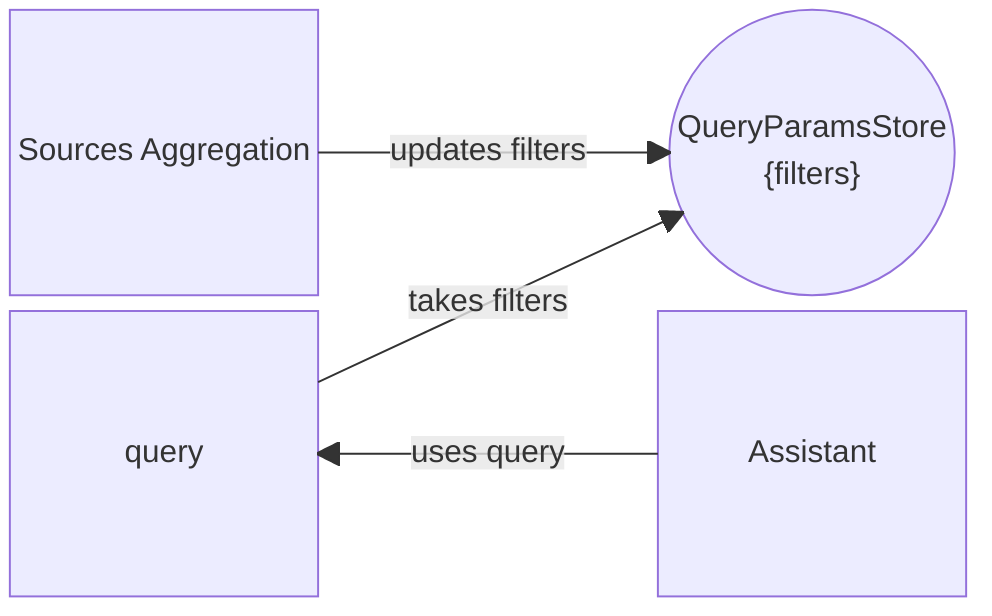

import useBaseUrl from '@docusaurus/useBaseUrl';

The `Assistant` page allows to chat with an assistant and to provide it with some context to find answers inside. For this, on the left side of the page are some components facilitate the filtering with a Sources aggregation filter component, and an upload component allowing to upload additional documents that can be choosen upon filtering in the "My Documents" source.

:::caution
A valid instance configuration for the assistant is required to be able to use it.
The configuration can be set in the customization JSON [`assistants`](../configurations/customization/custom-json-files.mdx#5-assistants) file of the Sinequa administration.
:::

## Standalone Assistant

To be allowed to use the assistant, the user needs to have the `service_id` sets in the Sinequa administration.

```json
{
  "standalone-assistant": {
    /* ... */
    "default_values": {
      // add
      "service_id": null
    }
  }
}
```

## Other Assistants

In addition to the standalone assistant, the application provides several other assistants, each designed for specific contexts:

- [**search-results-assistant**](#search-results-assistant): Appears on the search results page to assist with queries and provide contextual help based on the current search results.
- [**preview-summarize-assistant**](#preview-summarize-assistant): Available in the document preview, this assistant can summarize the content of the document being viewed.
- [**preview-chatwithdoc-assistant**](#preview-chatwithdoc-assistant): Also available in the document preview, this assistant allows you to chat directly with the content of the document, enabling more interactive exploration and Q&A within the preview.

Each assistant can be configured in the Sinequa administration under the `assistants` section of the customization JSON. Their presence and behavior are context-dependent, providing tailored assistance based on where they are used in the application.

### search-results-assistant

This assistant appears on the search results page. It provides contextual help and suggestions based on the current search results, helping users refine their queries and discover relevant information more efficiently.

To be allowed to use the assistant, the user needs to have the `service_id` sets in the Sinequa administration.

```json
{
  "search-results-assistant": {
    /* ... */
    "default_values": {
      // add
      "service_id": null
    }
  }
}
```


### preview-summarize-assistant

This assistant is available in the document preview. It can summarize the content of the document being viewed, offering a quick
overview and key insights without reading the entire document.

To be allowed to use the assistant, the user needs to have the `service_id` sets in the Sinequa administration.

```json
{
  "preview-summarize-assistant": {
    /* ... */
    "default_values": {
      // add
      "service_id": null
    }
  }
}
```


### preview-chatwithdoc-assistant

This assistant is also available in the document preview. It allows users to chat directly with the content of the document,
enabling interactive exploration and Q&A within the preview pane.

To be allowed to use the assistant, the user needs to have the `service_id` sets in the Sinequa administration.

```json
{
  "preview-chatwithdoc-assistant": {
    /* ... */
    "default_values": {
      // add
      "service_id": null
    }
  }
}
```


## Ask AI button

The `Ask AI` button allows users to interact with the assistant directly from the UI. This button is only available if the
`standalone-assistant` instance exists and its configuration is valid. If the configuration is missing or invalid, the button will
not be displayed.


The assistant source filtering is made possible with it taking the current query which includes the filters stored in the Query
Params Store.


