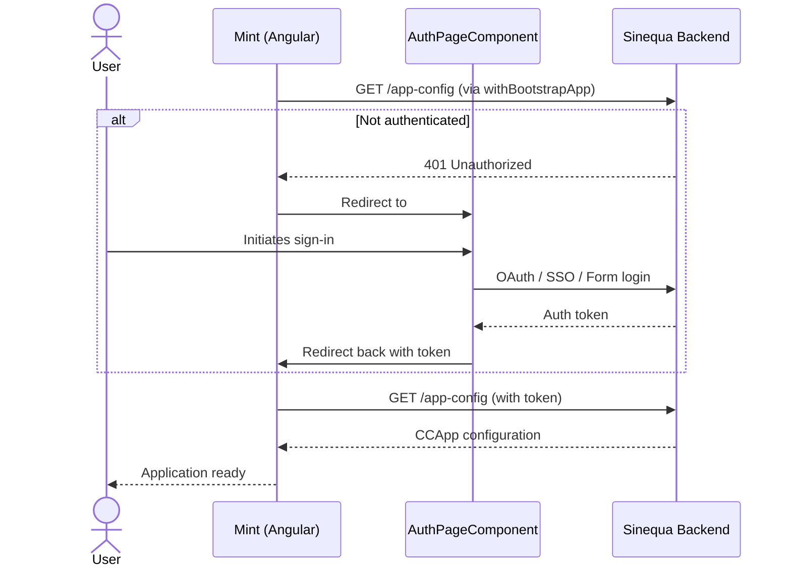
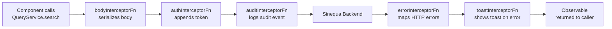
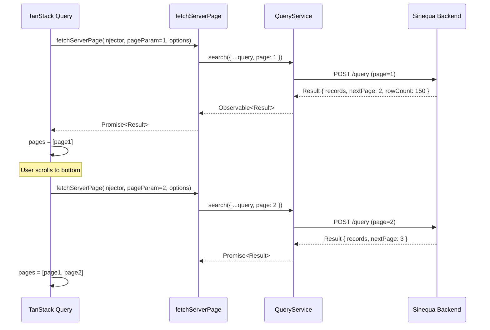

import Tabs from '@theme/Tabs';
import TabItem from '@theme/TabItem';

# Backend Connection

This page describes in detail how the Mint application communicates with the Sinequa backend, from the initial authentication to the execution of a search query.

## Authentication

### Flow

Authentication is handled by the `@sinequa/atomic-angular` library. The flow is:



### Auth Guard

Every protected route uses `AuthGuard()` from `@sinequa/atomic-angular`. If the user is not authenticated when navigating to a guarded route, they are redirected to `#/login`.

```typescript
// src/app2/routes.ts
{
  path: "search",
  component: SearchLayoutComponent,
  canActivate: [AuthGuard()],
  children: [...]
}
```

### Token Injection

Once the user is authenticated, the **`authInterceptorFn`** automatically appends the auth token to every outgoing HTTP request. This interceptor is provided globally in `app.config.ts`:

```typescript
provideHttpClient(
  withInterceptors([
    bodyInterceptorFn,
    authInterceptorFn,   // ← injects the token here
    auditInterceptorFn,
    errorInterceptorFn,
    toastInterceptorFn
  ])
)
```

No manual token management is needed anywhere in the application code.

## HTTP Interceptor Chain

Every HTTP request passes through five interceptors in sequence. The following diagram shows the lifecycle of a search request:



| Interceptor | Direction | Description |
|---|---|---|
| `bodyInterceptorFn` | Request + Response | Handles body serialization and transformation |
| `authInterceptorFn` | Request | Reads the stored token and adds it as a header or cookie |
| `auditInterceptorFn` | Request | Emits an audit event to the server for compliance tracking |
| `errorInterceptorFn` | Response | Catches 4xx/5xx and throws typed `SinequaError` objects |
| `toastInterceptorFn` | Response | Calls `notify.error()` for any caught HTTP error |

## QueryService

`QueryService` (from `@sinequa/atomic-angular`) is the single entry point for all search queries. It exposes a `search()` method that takes a `Query` object and returns an `Observable<Result>`:

```typescript
queryService.search(query): Observable<Result>
```

The `Query` object is a complex structure that includes:

| Field | Type | Description |
|---|---|---|
| `name` | `string` | The name of the Sinequa query defined in the admin |
| `text` | `string` | The full-text search string |
| `filters` | `LegacyFilter[]` | Active facet filters |
| `sort` | `string` | Sort field/order |
| `tab` | `string` | Active tab |
| `basket` | `string` | Basket ID (for basket-based search) |
| `page` | `number` | Requested page number (1-based) |
| `spellingCorrectionMode` | `SpellingCorrectionMode` | `"auto"`, `"on"`, or `"off"` |

## fetchServerPage

The function `fetchServerPage` (`src/config/fetch-server-page.ts`) is the bridge between TanStack Query and `QueryService`. It is called by the infinite query in `SearchAllComponent`:

```typescript
// src/config/fetch-server-page.ts
export function fetchServerPage(
  injector: Injector,
  offset: unknown = 1,
  { currentKeys, basket, id, q, tab, spellingCorrectionMode }
): Promise<Result> {

  // Guard: if no keys, return empty result immediately
  if (currentKeys === undefined) return Promise.resolve({} as Result);

  return runInInjectionContext(injector, () => {
    const queryService   = inject(QueryService);
    const selectionService = inject(SelectionService);

    // Merge static query with dynamic per-page parameters
    const query = { ...q, page: offset, tab, basket, spellingCorrectionMode };

    return lastValueFrom(
      queryService.search(query).pipe(
        // Add a `type: 'default'` field to each article for component resolution
        map(result => {
          result.records?.map(article => ({ ...article, value: article.title, type: 'default' }));
          return result;
        }),
        // If a record `id` is present in the URL, auto-open its preview
        map(result => {
          if (id) {
            result.records?.forEach(article => {
              if (article.id === id) selectionService.setCurrentArticle(article);
            });
          }
          return result;
        })
      )
    );
  });
}
```

### How `offset` (page number) is managed

TanStack Query calls `fetchServerPage` with a `pageParam` value for each page it needs to load:

- The **first page** uses `initialPageParam` (defaults to `1`, or the `p` URL param)
- Subsequent pages use `getNextPageParam`, which reads `result.nextPage` from the last loaded page
- The backend sets `result.nextPage = currentPage + 1` if more results are available, or leaves it `undefined` when the last page is reached



## Application Configuration Loading

When `withBootstrapApp` runs during initialization, it fetches the `CCApp` object from the backend. This object contains:

- List of available **queries** (with their names and configurations)
- **Feature flags** (e.g., `assistant`, `agent`, `multiConversion`)
- Registered **assistants** and their settings

This data is stored in `AppStore` and is available throughout the application:

```typescript
// Accessing app configuration in components
readonly appStore = inject(AppStore);

// Check if the assistant feature is allowed for a given instance
this.appStore.isAssistantAllowed('search-results-assistant')

// Get a named query configuration
this.appStore.getQueryByName('_default')

// Read general feature flags
this.appStore.general()?.features
```

## Error Handling

HTTP errors are intercepted at two levels:

1. **`errorInterceptorFn`** — converts HTTP responses with status ≥ 400 into typed `SinequaError` exceptions
2. **`toastInterceptorFn`** — subscribes to those errors and calls `notify.error()` to surface them as toast messages

Components can additionally handle specific status codes locally. For example, `HomeComponent` catches `401` and `404` errors from the initial aggregation fetch and handles them silently (avoiding a redirect loop on the home page).

## SignalR (Real-time Communication for Agent/Chat)

The chat feature (`/chat/**`) uses **Microsoft SignalR** for real-time bidirectional communication with the backend. This is managed by `SignalRWebService` from `@sinequa/agent`.

The connection lifecycle is handled in `AgentLayoutComponent`:

```typescript
// src/app2/pages/agent/agent.layout.ts
this.signalRWebService.signalREvents$
  .pipe(takeUntilDestroyed(this.destroyRef))
  .subscribe(event => {
    switch (event.state) {
      case HubConnectionState.Reconnecting:
        notify.error(`Connection lost. Attempt (${event.retryCount}/5)`, { duration: event.retryDelay });
        break;
      case HubConnectionState.Connected:
        notify.success("Connected!", { duration: 2500 });
        break;
      case HubConnectionState.Disconnected:
        notify.error("Could not connect. Please refresh.", { duration: Infinity });
        break;
    }
  });
```

**Retry delays:** `[0, 2000, 5000, 10000, 30000]` ms. After all retries are exhausted, a persistent error toast is shown with a "Refresh" button.
