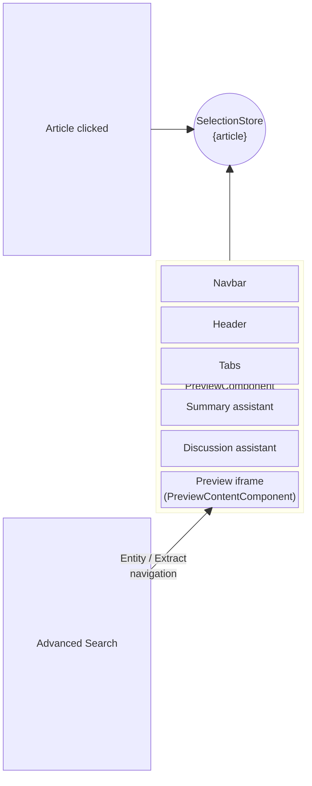
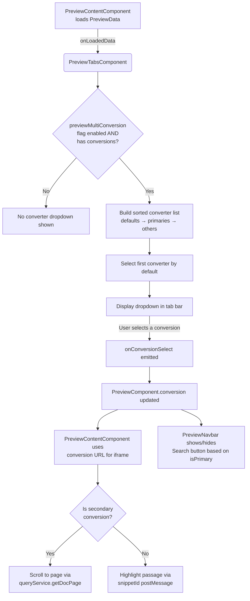

import useBaseUrl from '@docusaurus/useBaseUrl';

The Preview feature allows viewing the content of a document with contextual search tools.
It opens when a user clicks on a result card in the search results list.

## Architecture

The Preview component (`PreviewComponent`) is composed of the following sub-components:

- **Navbar** (`PreviewNavbarComponent`): action bar with buttons to open the document externally, bookmark it, copy its link, toggle the Advanced Search panel, and close the preview. It can also open the [Expanded Preview Dialog](#expanded-preview-dialog) if the feature flag is enabled.
- **Header** (`PreviewHeaderComponent`): displays the document's metadata such as title, location, modified date, type, and labels. Hidden on small container sizes.
- **Tabs** (`PreviewTabsComponent`): tab navigation between the document content, an AI Summary, and an AI Discussion (Chat with doc). AI tabs are only shown when the corresponding assistant instance is allowed.
- **Content** (`PreviewContentComponent`): fetches and renders the document inside an `<iframe>`. Includes a `<preview-navigator>` overlay for entity/passage navigation and a `<preview-actions>` overlay for additional controls.
- **Advanced Search** (`AdvancedSearch`): rendered directly alongside the content area as a collapsible panel. Allows searching within the document and navigating between entities and extracts.

## How the preview opens

Opening the preview does not use a drawer or stack component. Instead, it is driven entirely by `SelectionStore` and CSS animation classes in the search results template.

1. The user clicks an article card → `SelectionService.setCurrentArticle(article)` is called
2. `SelectionStore.article()` signal updates with the selected article
3. `SearchAllComponent.hasPreview()` computed signal becomes `true`
4. The `<preview>` element becomes visible with an `animate-slide-in-right` CSS class on desktop, or `SheetPreviewerComponent` opens as a side sheet on mobile/tablet
5. `PreviewComponent` reads the article directly from `SelectionStore` (no `@Input()` binding)
6. `PreviewContentComponent` starts fetching the `PreviewData` object from the backend

Closing the preview clears `SelectionStore` and removes `id` from the URL query parameters, causing `hasPreview()` to return `false` and the slide-out animation to play.

## Expanded Preview Dialog

When the `expandPreview` feature flag is enabled on the platform, an expand button appears in the preview navbar. Clicking it opens `PreviewDialogComponent` — a full-screen modal that renders the document preview with its own set of tabs:

| Tab | Description |
|---|---|
| Chat | Chat with the document (`preview-chatwithdoc-assistant` instance) |
| Summary | AI document summary (`preview-summarize-assistant` instance) |
| Find | Advanced search / entity navigation |

The dialog owns its own `PreviewService` instance, keeping it independent from the inline preview.

## Multi-conversion

### Overview

If configured on the platform side, multi-conversion can be enabled with the customization JSON's feature flag `previewMultiConversion`.
It is handled inside `PreviewTabsComponent` which relies on the feature flag and the `previewData.conversions` data fetched after the initial preview loading by `PreviewContentComponent`.

### Workflow

- Upon loading, `PreviewContentComponent` fetches `PreviewData` which contains its `conversions` data
- Based on that data and the `previewMultiConversion` flag, `PreviewTabsComponent` selects the first available conversion (defaults first, then primaries, then others), and displays a dropdown at the end of the tabs bar to allow switching between conversions
- The selected `CConverter` object is emitted via `onConversionSelect` to `PreviewComponent`, which stores it in the `conversion` signal and passes it to `PreviewNavbarComponent` (to conditionally show the "Search in document" button) and back to `PreviewContentComponent` (to use the right iframe URL)
- `PreviewContentComponent` uses the conversion's URL for the iframe. For secondary (non-primary) conversions, passage highlighting is replaced by page-level scrolling via `queryService.getDocPage()`

### Workflow Diagram

