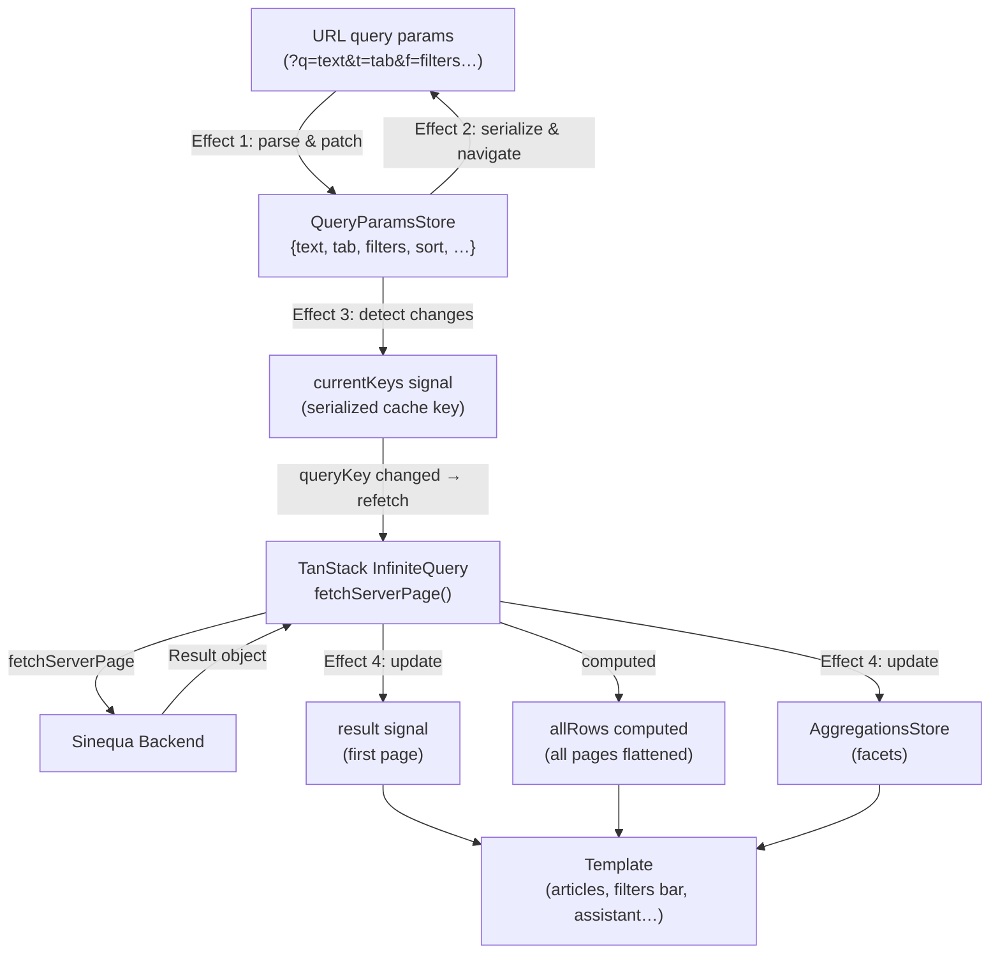

# Search Data Flow

This page describes in detail the complete lifecycle of a search — from the moment the user types a query to when the results appear on screen. The main actor is `SearchAllComponent` (`src/app2/pages/search/search-all.ts`).

## Overview



## URL ↔ Store Synchronization

The URL and the `QueryParamsStore` are kept **bidirectionally in sync** by two Angular effects.

### Effect 1 — URL → Store

Fires whenever a URL query parameter changes (e.g., browser back/forward, direct link, internal navigation):

```typescript
effect(() => {
  const filters = this.f() ? JSON.parse(this.f() ?? "") : [];
  this.queryParamsStore.patch({
    text: this.q(),
    tab:  this.t(),
    basket: this.b(),
    sort: this.s(),
    filters,
    name: this.n(),
    page: this.p(),
    id:   this.id(),
    spellingCorrectionMode: this.c()
  });
});
```

The `q`, `t`, `b`, `s`, `f`, `n`, `p`, `id`, `c` inputs are automatically bound from the URL thanks to `withComponentInputBinding()` in the router configuration.

### Effect 2 — Store → URL

Fires whenever any value in `QueryParamsStore` changes, keeping the URL up-to-date:

```typescript
effect(() => {
  const { id, text, filters, page, sort, tab, basket, name, spellingCorrectionMode }
    = getState(this.queryParamsStore);

  const queryParams = {
    f: filters.length > 0 ? JSON.stringify(filters) : undefined,
    p: page,
    s: sort,
    t: tab,
    q: text,
    b: basket,
    n: name,
    c: spellingCorrectionMode,
    id
  };

  this.router.navigate([], {
    relativeTo: this.route,
    queryParamsHandling: "merge",
    queryParams
  });
});
```

This makes every search state **bookmarkable and shareable** via the URL.

## URL Parameter Reference

| URL param | Store field | Type | Description |
|---|---|---|---|
| `q` | `text` | `string` | Full-text search query |
| `t` | `tab` | `string` | Active tab name |
| `f` | `filters` | `LegacyFilter[]` (JSON) | Active facet filters |
| `s` | `sort` | `string` | Sort field name |
| `b` | `basket` | `string` | Basket ID |
| `n` | `name` | `string` | Sinequa query name |
| `p` | `page` | `number` | Initial page number |
| `c` | `spellingCorrectionMode` | `"auto"` \| `"on"` \| `"off"` | Spelling correction |
| `id` | `id` | `string` | Record ID to auto-open in preview |

## Effect 3 — Detecting Meaningful Changes

Not every store update should retrigger an HTTP request. Effect 3 computes a cache key from the fields that actually affect query results:

```typescript
effect(() => {
  const { tab, text, filters, sort, basket, name, page, spellingCorrectionMode }
    = getState(this.queryParamsStore);

  const r = { tab, text, filters, sort, basket, name, page, spellingCorrectionMode };

  untracked(() => {
    if (JSON.stringify(this.currentKeys()) !== JSON.stringify(r)) {
      this.currentKeys.set(r);
    }
  });
});
```

Note that `id` is intentionally excluded — opening a preview (which writes `id` to the store) must not trigger a new search.

## TanStack Infinite Query

`SearchAllComponent` uses an **infinite query** to support incremental page loading:

```typescript
query = injectInfiniteQuery<Result>(() => ({
  queryKey: [`search-${this.t()}`, this.currentKeys(), this.userOverrideActive()],
  queryFn: ({ pageParam }) => fetchServerPage(this.injector, pageParam, {
    currentKeys: this.currentKeys(),
    basket:      this.b(),
    id:          this.id(),
    q:           this.queryParamsStore.getQuery(),
    tab:         this.t(),
    spellingCorrectionMode: this.c()
  }),
  initialPageParam:      this.p(),
  getPreviousPageParam:  firstPage => firstPage.previousPage ?? undefined,
  getNextPageParam:      lastPage  => lastPage.nextPage      ?? undefined
}));
```

### Query Key Strategy

The query key has three parts:

1. `` `search-${tab}` `` — prevents cache collisions between tabs
2. `currentKeys()` — triggers a full refetch when any search parameter changes
3. `userOverrideActive()` — refetches when an admin overrides the acting user

Changing any part of the key causes TanStack Query to discard all accumulated pages and start from page 1.

### Pagination

| Property | Behavior |
|---|---|
| `initialPageParam` | The page number on first load (from the `p` URL param, defaults to `1`) |
| `getNextPageParam` | Reads `result.nextPage` — the backend sets this to `currentPage + 1` if more pages exist |
| `getPreviousPageParam` | Reads `result.previousPage` — used for reverse pagination if needed |
| `query.hasNextPage()` | `true` while `getNextPageParam` returns a value |
| `query.fetchNextPage()` | Appends the next page to the `pages` array |

## Effect 4 — Propagating Results

Once the query succeeds, Effect 4 updates the local `result` signal and populates the `AggregationsStore` (used by the filters bar):

```typescript
effect(() => {
  this.query.isSuccess();
  const result = this.query.data()?.pages[0];
  if (!result) return;

  this.result.set(result);
  this.aggregationsStore.update(result.aggregations);
});
```

Only the **first page** is used here because `result.rowCount` and `aggregations` are the same across all pages of the same query.

## Infinite Scroll

All loaded pages are flattened into a single computed array:

```typescript
allRows = computed(() =>
  this.query.data()?.pages?.flatMap(page => page.records) ?? []
);
```

A sentinel `<div>` at the bottom of the result list listens for intersection:

```html
<div class="h-3.75" infinity-scroll (onScroll)="nextPage()"></div>
```

```typescript
nextPage() {
  this.query.hasNextPage() && this.query.fetchNextPage();
}
```

When the sentinel enters the viewport, `fetchNextPage()` is called. TanStack Query calls `fetchServerPage` with `pageParam = result.nextPage`, and the new records are appended to `allRows`.

## Dynamic Article Rendering

For each record in `allRows`, the correct card component is resolved at runtime based on the document's format:

```typescript
getArticleType(docType?: string): Type<unknown> {
  return getComponentsForDocumentType(docType).articleComponent;
}
```

In the template:

```html
@for (article of allRows(); track article.id) {
  <ng-container *ngComponentOutlet="getArticleType(article.docformat)" />
}
```

The `document-type-registry` (`src/registry/document-type-registry.ts`) maps format strings to component pairs:

| Document type | Article component | Preview component |
|---|---|---|
| `default` (all others) | `RecordCard` | `PreviewComponent` |
| `pptx`, `ppt`, `powerpoint` | `SlideCard` | `PreviewComponent` |

## UI States

The template handles three distinct states:

### Loading state
Skeleton loaders are shown while `query.isPending()` is `true`:

```html
@if (query.isPending()) {
  <card-skeleton />
}
```

### Results state
The full UI is rendered when `hasRowCount()` is `true`:
- Navbar tabs (if tab search is active)
- Filters bar (populated from `AggregationsStore`)
- `SearchActionsComponent` (sort, select all, did-you-mean, sponsored results)
- Article list with infinite scroll
- Preview panel or assistant overview (desktop)
- Sheet previewer modal (mobile/tablet)

### No results state
`<no-result>` component is shown when the query succeeds but `rowCount === 0`.

## Responsive Layout

The component defines its own breakpoint at **1024 px** (wider than the global mobile breakpoint of 768 px) to trigger the sheet-based preview on tablets as well as phones:

```typescript
const MOBILE_BREAKPOINT = 1024; // px

isMobile = computed(() =>
  this.breakpointService.isMobile() || this.currentInnerWidth() < MOBILE_BREAKPOINT
);
```

| Layout | Preview behavior |
|---|---|
| Desktop (≥ 1024 px) | Right-side panel with slide-in/out animation |
| Mobile / Tablet (< 1024 px) | Sheet dialog (bottom drawer overlay) |

## Multi-selection

`SearchAllComponent` tracks a tri-state checkbox to support bulk operations:

```typescript
selectedAll = signal<"all" | "some" | "none">("none");
```

Effect 5 computes this state by comparing loaded record IDs against `SelectionStore.multiSelection()`:

- `"all"` — every loaded record is in the selection
- `"some"` — at least one, but not all records are selected
- `"none"` — no records are selected

`selectAll()` and `unselectAll()` iterate over all pages to add/remove records from `SelectionStore`.

## Recent Searches

Each time a non-empty search is executed (Effect 7), the current query is appended to the user's recent search history:

```typescript
if (text && text !== "") {
  void this.userSettingsStore.addCurrentSearch(query as QueryParams);
}
```

This powers the "Recent Searches" widget available at `#/widgets/recent-searches`.
