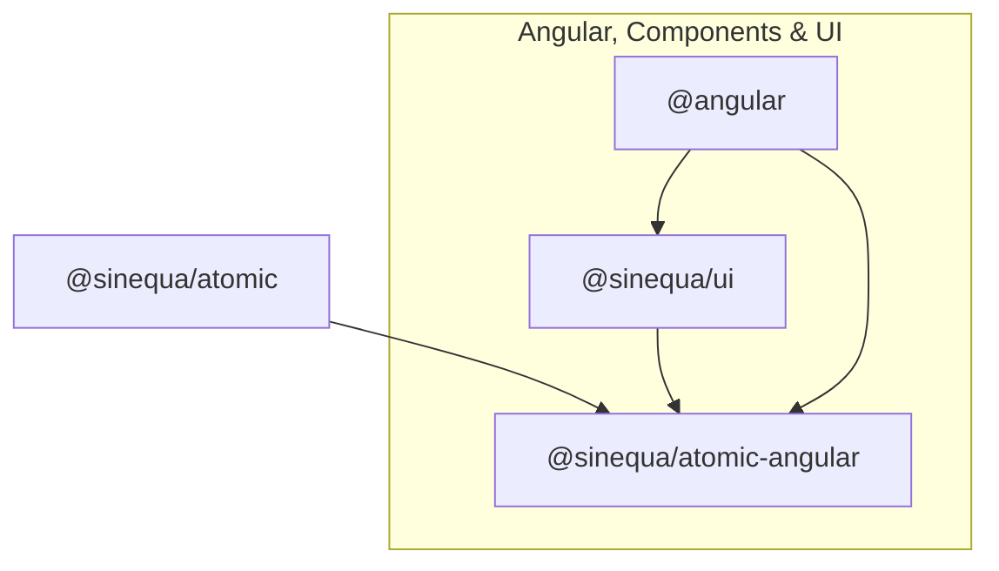

## Step-by-Step Guide to Create a Mint Clone Application

Follow these steps to create a new Mint clone application:

### 🧰 Prerequisites

- **Node.js**: Install Node.js (v20.x or later recommended) from [nodejs.org](https://nodejs.org/).
- **npm**: Comes with Node.js. Verify with `npm -v`.

### 🛠️ Install Angular CLI

Open your terminal and run:

```sh
npm install -g @angular/cli@20
```

### 🚀 Create a New Angular Project

```sh
ng new mint-clone --inline-style --inline-template --skip-tests --routing=true --style=css --zoneless
```

- Choose options as needed (e.g., add Angular routing, stylesheet format).

### 📦 Add Mint Clone Dependencies

Navigate to your project folder and install the necessary dependencies:

```sh
cd mint-clone
npm install @sinequa/atomic
```

:::caution
The following dependencies is mandatory to work with Sinequa:

| Dependency                | Description                                                      |
|---------------------------|------------------------------------------------------------------|
| `@sinequa/atomic`         | Core Sinequa and utilities.                 |

:::

:::tip
The following dependencies are optional but recommended for a complete Mint clone experience:

| Dependency                | Description                                                      |
|---------------------------|------------------------------------------------------------------|
| `@sinequa/atomic-angular` | Angular integration for @sinequa/atomic.               |
| `@sinequa/ui`             | Shared Sinequa UI components and design system utilities.        |

:::

#### Schema Dependencies

Represented in the diagram below, these dependencies are essential for building a Mint clone application using Sinequa's
 components and Angular integration.



### 🎨 Install Tailwind CSS

:::note
This part is not mandatory, but it is highly recommended if you expect to use the Sinequa UI components, as they are designed to work seamlessly with Tailwind CSS.
:::
To install Tailwind CSS, follow the official [Tailwind CSS Angular guide](https://tailwindcss.com/docs/installation/framework-guides/angular).

### 📦 Package Configuration

:::note
The `package.json` does not include the `@sinequa/atomic-angular` and `@sinequa/ui` dependencies, as they are optional. If you want to use them, you can install them with the following command:

```sh
npm install @angular/cdk@20 @sinequa/atomic-angular@latest @sinequa/ui@latest @jsverse/transloco
```

:::
Ensure your `package.json` file includes the necessary dependencies. Below the expected configuration:

<details>
  <summary>package.json file</summary>
```json title="package.json"
{
  "name": "mint-clone",
  "version": "0.0.1",
  "private": true,
  "scripts": {
    "ng": "ng",
    "start": "ng serve",
    "build": "ng build"
  },
  "dependencies": {
    "@angular/common": "^20.0.0",
    "@angular/compiler": "^20.0.0",
    "@angular/core": "^20.0.0",
    "@angular/forms": "^20.0.0",
    "@angular/platform-browser": "^20.0.0",
    "@angular/router": "^20.0.5",
    // add-start
    "@sinequa/atomic": "^0.0.101",
    "@tailwindcss/postcss": "^4.1.11",
    "postcss": "^8.5.6",
    // add-end
    "rxjs": "~7.8.0",
    // add
    "tailwindcss": "^4.1.11",
    "tslib": "^2.3.0"
  },
  "devDependencies": {
    "@angular/build": "^20.0.0",
    "@angular/cli": "^20.0.0",
    "@angular/compiler-cli": "^20.0.0",
    "typescript": "^5.8.2"
  }
}
```
</details>

:::note
Version numbers may vary based on the latest releases. Ensure you use compatible versions for your project.
:::

### 📝 Update the tsconfig.json file

Ensure your `tsconfig.json` file includes the following configuration:

```json title="tsconfig.json"
{
  "compilerOptions": {
    "strict": true,
    /* ... other options ... */
    // add-start
    "paths": {
      "@sinequa/atomic": ["./node_modules/@sinequa/atomic/dist"]
    }
    // add-end
  }
}
```

:::note
This configuration ensures that TypeScript can resolve the paths for the`@sinequa/atomic` library correctly.
:::

## Configuring the Application

### 🛠️ Configure Proxy for Sinequa

Create a `proxy.conf.json` file in the root of your project with the following content:

```json title="proxy.conf.json"
[
  {
    "context": [
      "/api",
      "/xdownload",
      "/auth/redirect",
      "/saml/redirect",
      "/r",
      "/endpoints",
      "/assets"
    ],
    "target": "https://your-sinequa-instance.com",
    "secure": false,
    "changeOrigin": true,
    "ws": true
  }
]
```

#### Proxy Configuration Properties

| Property      | Description                                                                                   |
|---------------|-----------------------------------------------------------------------------------------------|
| `context`     | Array of URL paths to proxy. Requests matching these paths will be forwarded to the target.   |
| `target`      | The backend server URL where matching requests are sent (replace with your Sinequa instance). |
| `secure`      | If `false`, allows proxying to servers with self-signed SSL certificates.                     |
| `changeOrigin`| If `true`, modifies the `Origin` header to match the target URL.                              |
| `ws`          | Enables proxying of WebSocket connections if set to `true`.                                   |

Replace `https://your-sinequa-instance.com` with the actual URL of your Sinequa instance.

### ⚙️ Set Sinequa Configuration Environment

In your Angular project, create a configuration file for Sinequa. This file will typically be named `environment.ts` and should be placed in the `src/environments` directory.

```typescript title="src/environments/environment.ts"
export const environment = {
  BACKEND_URL: 'https://your-sinequa-instance.com',
  BEARER_TOKEN: 'your-bearer-token',
  APP_NAME: 'your-app-name',
  OAUTH_PROVIDER: 'your-oauth-provider',
  SAML_PROVIDER: 'your-saml-provider',
};
```

Replace the placeholders with your actual Sinequa instance details. This configuration will be used to connect your Angular application to the Sinequa backend.

#### Configure your Sinequa environment in your Angular application

Below is an example of how to set up the Sinequa configuration with OAuth provider in your `main.ts` file:

```typescript title="src/main.ts"
// Sinequa imports
import { setGlobalConfig } from '@sinequa/atomic';
import { environment } from './environments/environment';

setGlobalConfig({
  app: environment.APP_NAME,
  // backendUrl: environment.BACKEND_URL,
  // bearerToken: environment.BEARER_TOKEN,
  autoOAuthProvider: environment.OAUTH_PROVIDER,
});
```

#### Configure your Sinequa provider in your Angular application

In your `app.config.ts` file, you can set up the Sinequa provider as follows:

```typescript title="src/app/app.config.ts"
import { ApplicationConfig, provideAppInitializer, provideBrowserGlobalErrorListeners, provideZonelessChangeDetection } from '@angular/core';
// add-start
import { provideRouter } from '@angular/router';
import { appInitializerFn } from '@sinequa/atomic';
// add-end

export const appConfig: ApplicationConfig = {
  providers: [
    provideBrowserGlobalErrorListeners(),
    provideZonelessChangeDetection(),
    // add-start
    provideRouter([]),
    provideAppInitializer(appInitializerFn)
    // add-end
  ]
};
```

#### Sinequa Provider Table

The following table explains the purpose of each provider configured in the `appConfig`:

| Provider                                   | Purpose                                                                                   |
|---------------------------------------------|-------------------------------------------------------------------------------------------|
| `provideBrowserGlobalErrorListeners()`      | Registers global error listeners for improved error handling in the browser environment.   |
| `provideZonelessChangeDetection()`          | Enables Angular's zoneless change detection for better performance and reduced overhead.   |
| `provideRouter([])`                        | Sets up Angular's router; the empty array means no routes are defined yet.                |
| `provideAppInitializer(appInitializerFn)`   | Runs the Sinequa app initializer function during application startup. This will configure the Sinequa environment depending on the provided configuration in the administration page. |

### 🔐 Start Authentication Flow

To start the authentication flow, you can create a simple login function that redirects the user to the Sinequa login page. Below is an example of how to implement this in your Angular application:

```typescript title="src/app/app.ts"
import { Component, DestroyRef, inject, signal } from '@angular/core';
import { login, logout } from '@sinequa/atomic';

@Component({
  selector: 'app-root',
  imports: [],
  template: `<div>{{ isAuthenticated() ? 'Authenticated' : 'Not Authenticated' }}</div>`,
})
export class App {
  // Injects
  protected destroyRef = inject(DestroyRef);

  // Signals
  protected isAuthenticated = signal(false);

  constructor() {
    // Automatically log in when the application starts
    this.handleLogin();

    // Set up a destroy handler to log out when the component is destroyed
    // This is useful for cleanup in case the application has a single-page architecture
    this.destroyRef.onDestroy(() => logout());
  }

  protected handleLogin() {
    login().then((value) => this.isAuthenticated.set(value));
  }

  protected handleLogout() {
    this.isAuthenticated.set(false);
    logout();
  }
}
```

### 🚦 Start the Development Server

```sh
npm start -- --ssl=true --proxy-config=proxy.conf.json
```

- Open your browser at [https://localhost:4200](https://localhost:4200) to view your Mint clone app.

## ✨ Download Starter Template

If you prefer to start with a pre-configured setup, you can download the starter template:
[starter.zip](/starter/starter.zip) contains a basic setup of the Mint clone application with the necessary dependencies and configurations.
