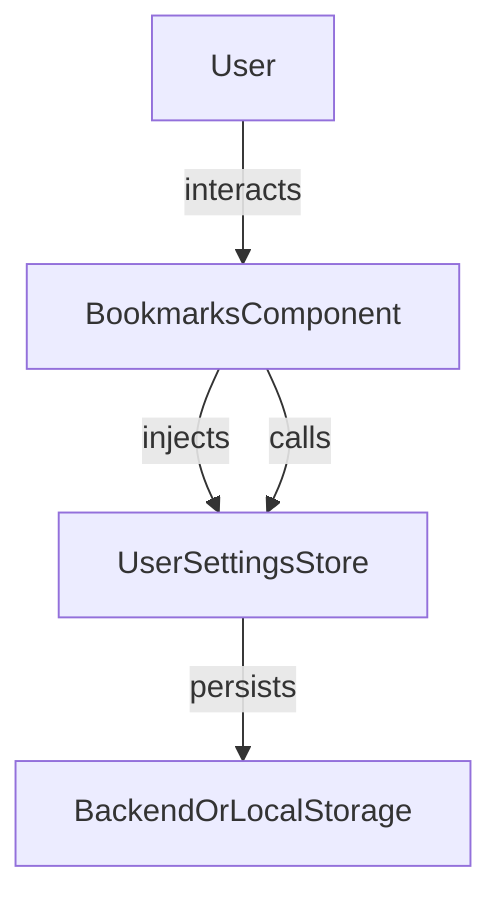

The `Bookmarks` feature provides an user interface and logic for managing bookmarked articles or items within your Angular application. It allows users view and remove bookmarks, and integrates with stores and services for persistence and state management.

## Usage

```ts title="sample.component.ts"
import { BookmarksComponent } from "@angular/atomic-angular";

@Component({
    selector: "sample-component",
    template: `
    <bookmarks />
    `,
})
export class SampleComponent {
    // The component automatically loads and displays user bookmarks
}
```

### Properties

| Property         | Type                       | Description                                 |
|-----------------|----------------------------|---------------------------------------------|
| `bookmarks`     | `computed<Bookmark[]>`   | List of all bookmarks                   |
| `range`       | `signal<number>`                  | Current range of bookmarks to display. Defaults to 10          |
| `paginatedBookmarks`     | `computed<Bookmark[]>`   | List of displayed bookmarks according to the current range                   |
| `hasMore`         | `computed<boolean>`            | Whether there are more bookmarks to be displayed              |

### Methods

| Method                | Description                                 |
|----------------------|---------------------------------------------|
| `onClick(bookmark)`  | Opens a bookmarked document in the preview drawer                   |
| `onDelete(bookmark, event)`| Removes an item from the bookmarks              |
| `loadMore()`   | Expands the range to display more bookmarks                       |

## Customization

You can customize the behavior and display of the bookmarks feature using the `BOOKMARKS_CONFIG` injection token. It allows you to configure options such as the pagination, the visibility of the "Load More" button, and the route used for bookmarks navigation.

### BOOKMARKS_CONFIG

`BOOKMARKS_CONFIG` is the default configuration object for bookmarks. It defines properties such as:

- `itemsPerPage`: Number of bookmarks to display per page (default: 10)
- `showLoadMore`: Whether to show a "Load More" button (default: true)
- `routerLink`: The route to use for bookmarks navigation (default: '/bookmarks')

You can override these defaults by providing your own options.

### Example: Providing Custom Options (Standalone API)

```ts
import { BOOKMARKS_CONFIG, BookmarksConfig, BookmarksComponent } from '@sineque/atomic-angular';

const customBookmarksOptions: BookmarksConfig = {
  itemsPerPage: 20,
  showLoadMore: true,
  routerLink: '/my-bookmarks'
};

@Component({
  selector: 'app-root',
  standalone: true,
  imports: [BookmarksComponent],
  providers: [
    { provide: BOOKMARKS_CONFIG, useValue: customBookmarksOptions }
  ],
  template: `<bookmarks />`
})
export class AppComponent {}
```

This approach allows you to:

- Change pagination and display options for bookmarks
- Customize routing and UI behavior
- Apply different configurations in different parts of your app

See the `BOOKMARKS_CONFIG` definitions in your codebase for all available options.

### Features

- View and remove bookmarks
- Persistent storage (via store or backend)
- Integrates with article or item components
- Customizable parameters

## Visual Schema



## Notes

- Bookmarks are typically user-specific and may be stored locally or on the backend.
- The component can be used standalone or integrated into toolbars, drawers, or menus.
