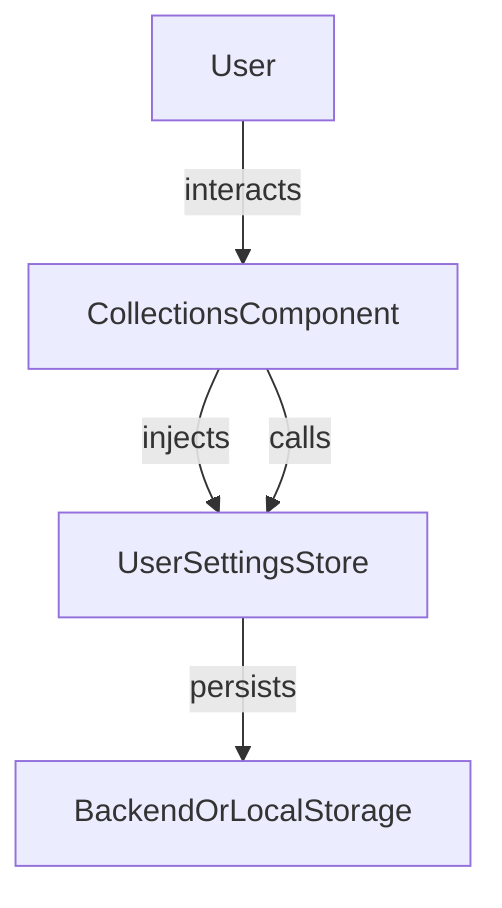

The `Collections` feature allows users to view and manage named groups of articles or items (collections) in your Angular application. Collections can be used for organizing, sharing, or batch-processing items.

## Usage

```ts title="sample.component.ts"
import { CollectionsComponent } from "@angular/atomic-angular";

@Component({
    selector: "sample-component",
    template: `
    <collections />
    `,
})
export class SampleComponent {
    // The component automatically loads and displays user collections
}
```

### Properties

| Property         | Type                         | Description                                 |
|-----------------|------------------------------|---------------------------------------------|
| `range`   | `signal<number>`   | The current range of displayed collections                    |
| `collections`   | `computed<Basket[]>`   | List of all user collections                    |
| `paginatedCollections`   | `computed<Basket[]>`   | List of the displayed user collections                    |
| `hasMore`         | `computed<boolean>`            | Whether there are more collections to be displayed              |

### Methods

| Method                | Description                                 |
|----------------------|---------------------------------------------|
| `onClick(collection)`| Redirects to the search page with a filter on the clicked collection                     |
| `onDelete(collection, index, event)`| Deletes a collection                      |
| `loadMore(event)`| Expands the range to display more collections    |

### Features

- Open and delete collections
- UI for managing and viewing collections

## Visual Schema



## Notes

- The component can be used in sidebars, drawers, or as a standalone page.

## Customization

You can customize the behavior and display of the collections feature using the `COLLECTIONS_CONFIG` injection token. It allows you to configure options such as pagination, the visibility of the "Load More" button, and the route used for collections navigation.

### COLLECTIONS_OPTIONS

`COLLECTIONS_OPTIONS` is the default configuration object for collections. It defines properties such as:

- `itemsPerPage`: Number of collections to display per page (default: 10)
- `showLoadMore`: Whether to show a "Load More" button (default: false)
- `routerLink`: The route to use for collections navigation (default: '/collections')

You can override these defaults by providing your own options.

### Example: Providing Custom Options (Standalone API)

```ts
import { COLLECTIONS_CONFIG, CollectionsConfig, CollectionsComponent } from '@sinequa/atomic-angular';

const customCollectionsOptions: CollectionsConfig = {
  itemsPerPage: 20,
  showLoadMore: true,
  routerLink: '/my-collections'
};

@Component({
  selector: 'app-root',
  standalone: true,
  imports: [CollectionsComponent],
  providers: [
    { provide: COLLECTIONS_CONFIG, useValue: customCollectionsOptions }
  ],
  template: `<collections />`
})
export class AppComponent {}
```

This approach allows you to:

- Change pagination and display options for collections
- Customize routing and UI behavior
- Apply different configurations in different parts of your app

See the `COLLECTIONS_CONFIG` definitions in your codebase for all available options.
