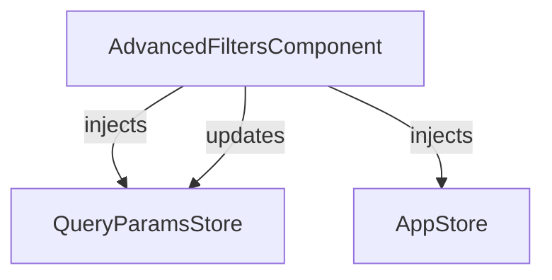
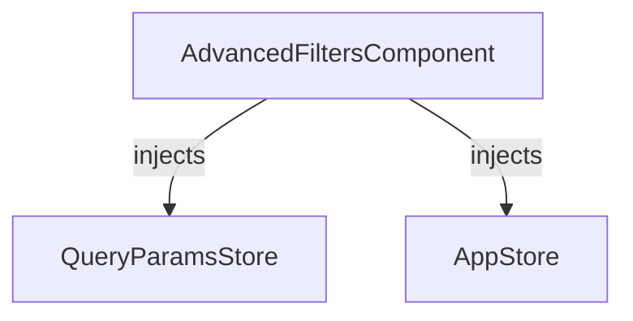

The `AdvancedFiltersComponent` provides a drawer-based UI for advanced filter management, including custom fields, suggestions, and fielded search.

## Features

- Drawer UI for advanced filter management
- Supports fielded search (content, title, location)
- Provides suggestions and custom filter logic
- Integrates with query parameters and stores

## Methods

- `addItem(item, filter)`: Add a filter value
- `removeItem(item, filter)`: Remove a filter value
- `onSearch()`: Apply all filters and update query

## Component Interaction Schema

## Store Interaction Schema

## Notes

- The advanced filters drawer is optional and can be used alongside the filters bar.
- All filter state is managed via stores, ensuring consistency across the UI.
