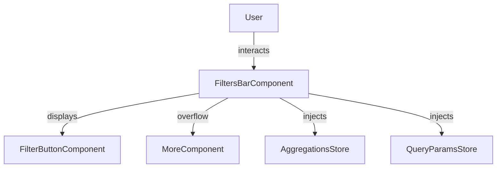
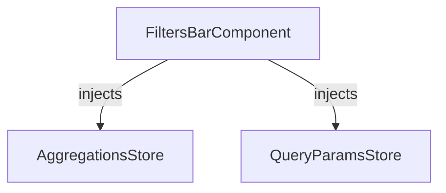

The `FiltersBarComponent` displays all active filters as buttons, provides clear-all and basket management, and handles overflow. It acts as the main UI for interacting with applied filters.

## Features

- Displays all active filters as buttons
- Supports clearing all filters or basket
- Integrates with aggregations and advanced filters
- Handles overflow with a "More" button

## Properties

| Property         | Type     | Description                                 |
|-----------------|----------|---------------------------------------------|
| `filters`       | array    | List of active filters                      |
| `hasFilters`    | boolean  | Whether any filters are currently applied   |
| `currentBasket` | string   | Name of the current basket, if any          |

## Events

| Event         | Type                | Description                      |
|---------------|---------------------|----------------------------------|
| `clearFilters`| `() => void`        | Clears all filters               |
| `clearBasket` | `() => void`        | Clears the basket                |

## Component Interaction Schema

## Store Interaction Schema

## Notes

- The filters bar is highly modular and can be used independently or with other filter components.
- All filter state is managed via stores (`AggregationsStore`, `QueryParamsStore`, etc.), ensuring consistency across the UI.
