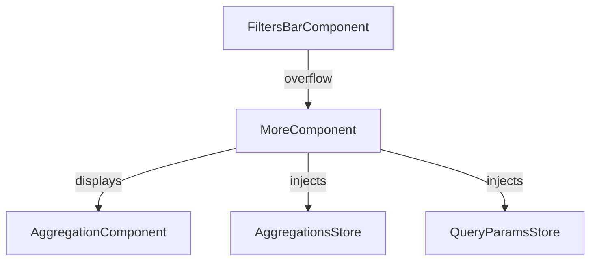
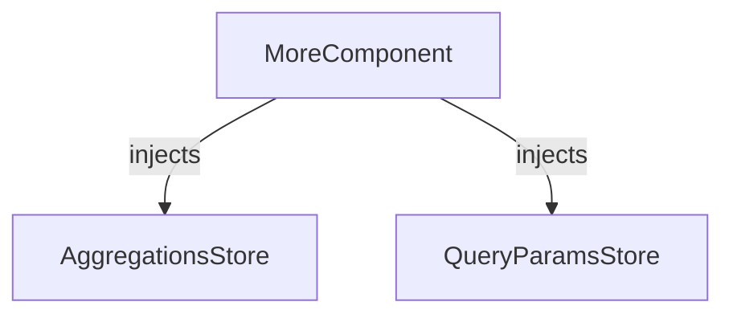

The `MoreComponent` handles overflowed filters and provides access to additional filter controls. It is used by the `FiltersBarComponent` when there are more filters than can be displayed in the available space.

## Features

- Displays overflowed filters in a dropdown or expandable area
- Integrates with aggregations and filter state
- Provides access to additional filter actions

## Component Interaction Schema

## Store Interaction Schema

## Notes

- The `MoreComponent` is automatically used by the filters bar when needed.
- It ensures all filters remain accessible, even when space is limited.
