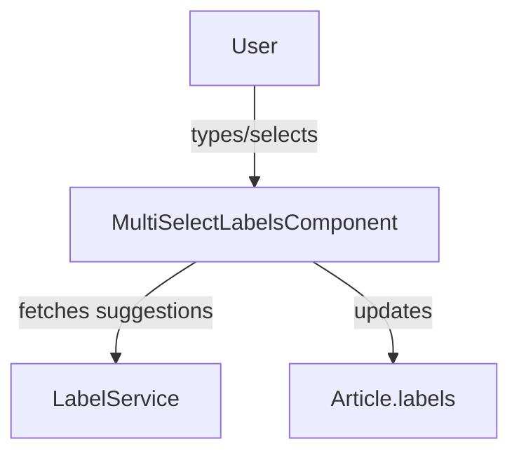

The `MultiSelectLabelsComponent` provides a user interface for adding, removing, and suggesting multiple labels (tags) on an article or item. It supports both public and private labels, keyboard navigation, and integrates with label suggestion services.

## Usage

```ts
import { MultiSelectLabelsComponent } from '@angular/atomic-angular';

@Component({
  selector: 'my-component',
  template: `
    <multiselect-labels [(article)]="article" [labelsField]="'publicLabels'" />
  `,
  imports: [MultiSelectLabelsComponent]
})
export class MyComponent {
  article = { /* ... */ };
}
```

## Properties

| Property      | Type      | Description                                 |
|--------------|-----------|---------------------------------------------|
| `article`    | object    | The article or item to which labels are attached |
| `labelsField`| string    | The field name for labels (e.g., 'publicLabels') |

## Features

- Add and remove labels with keyboard or mouse
- Suggest labels as you type (with debounced input)
- Supports both public and private labels
- Integrates with i18n for UI strings

## Process Schema



## Notes

- Suggestions are fetched from the backend via the `LabelService`.
- The component is fully standalone and can be used in dialogs or forms.
