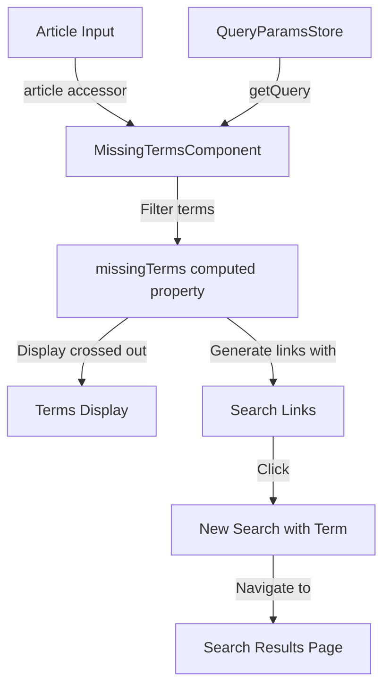

The `MissingTerms` component displays search terms that were not found in the current article and provides options to include them in a new search.

## Usage

```ts title="sample.component.ts"
import { MissingTermsComponent } from "@angular/atomic-angular";

@Component({
    selector: "sample-component",
    template: `
    <missing-terms [article]="article" />
    `,
}) export class SampleComponent {
    article = {
        id: "document1",
        title: "Sample Document",
        termspresence: [
            { term: "analytics", presence: "missing" },
            { term: "dashboard", presence: "missing" },
            { term: "report", presence: "present" }
        ]
    };
}
```

### Properties

| Property | Type | Description |
|---|---|---|
| `article` | `input<Article>` | Required input property for the article to analyze for missing terms. |
| `missingTerms` | `computed<Array<{value: string, queryParams: object}>>` | Computed property that returns an array of missing terms with their query parameters for search links. |

### Features

- Identifies search terms not found in the current document
- Displays missing terms with a strikethrough style
- Provides clickable links to perform a new search requiring those terms
- Updates query parameters to force inclusion of missing terms
- Integrates with translation services for internationalization
- Prevents event propagation when clicking on term links inside clickable containers

## Visual Schema

### Component Flow Diagram


