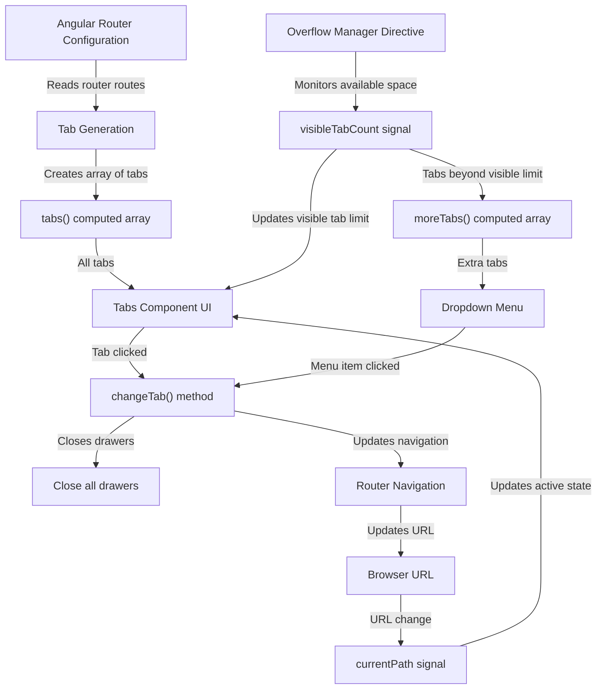
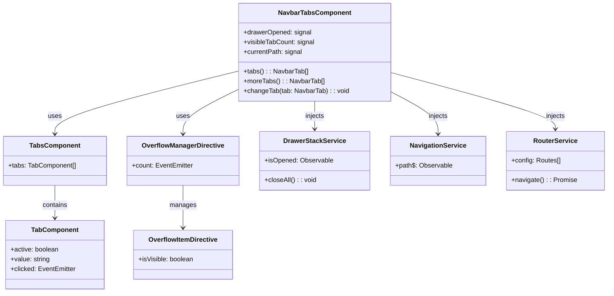
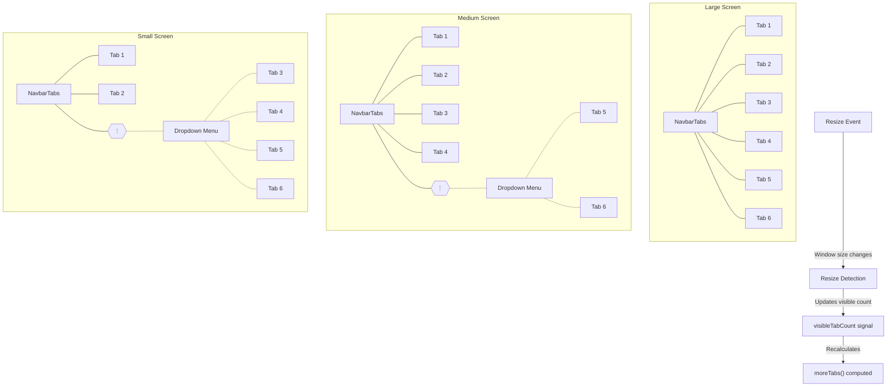

The `NavbarTabs` component provides a responsive navigation tab system that automatically handles overflow by moving extra tabs to a dropdown menu in your Angular applications.

## API reference

### Inputs

| Property    | Type              | Description                                                                    |
| ----------- | ----------------- | ------------------------------------------------------------------------------ |
| `showCount` | `Input<boolean>`  | Determines whether the count should be displayed in the navbar tabs component. |

## Usage

```ts title="sample.component.ts"
import { NavbarTabsComponent } from "@sinequa/atomic-angular";

@Component({
    selector: "sample-component",
    imports: [NavbarTabsComponent],
    template: `
    <navbar-tabs [showCount]="true" />
    `,
}) export class SampleComponent {
    // The component automatically reads routes from router configuration
    // and displays them as tabs
}
```

### Features

- Automatically generates tabs from router configuration
- Handles responsive overflow with dropdown menu for extra tabs
- Supports tab icons
- Preserves search text when switching tabs
- Integrates with router for navigation

## Visual Schema

### UI Layout

```ascii
┌─────────────────────────────────────────────────────────────────────────┐
│                             NavbarTabsComponent                         │
├─────────────────────────────────────────────────────────────────────────┤
│                                                                         │
│  ┌───────────────────┐ ┌───────────────┐ ┌───────────────┐ ┌─────────┐  │
│  │     Tab 1         │ │    Tab 2      │ │    Tab 3      │ │    ⋮    │  │
│  │  (Visible Tab)    │ │ (Visible Tab) │ │ (Visible Tab) │ │(Overflow│  │
│  └───────────────────┘ └───────────────┘ └───────────────┘ │  Menu)  │  │
│                                                            └─────────┘  │
│                                                                ▼        │
│                                                          ┌───────────┐  │
│                                                          │  Tab 4    │  │
│                                                          │  Tab 5    │  │
│                                                          │  Tab 6    │  │
│                                                          └───────────┘  │
│                                                                         │
└─────────────────────────────────────────────────────────────────────────┘
```

### Component Flow Diagram



### Component Architecture



### Responsive Behavior Visualization



### Component Flow

1. **Router Configuration**: Reads tab information from the Angular router configuration
2. **Tab Generation**: Creates tabs from router routes with paths and display names
3. **Overflow Detection**: Uses `overflowManager` directive to detect available space
4. **Visible Tab Count**: Updates `visibleTabCount` signal when layout changes
5. **Overflow Menu**: Places tabs that don't fit (using `moreTabs()` computed property) into a dropdown menu
6. **Navigation**: When a tab is clicked, it uses router navigation and maintains query parameters
