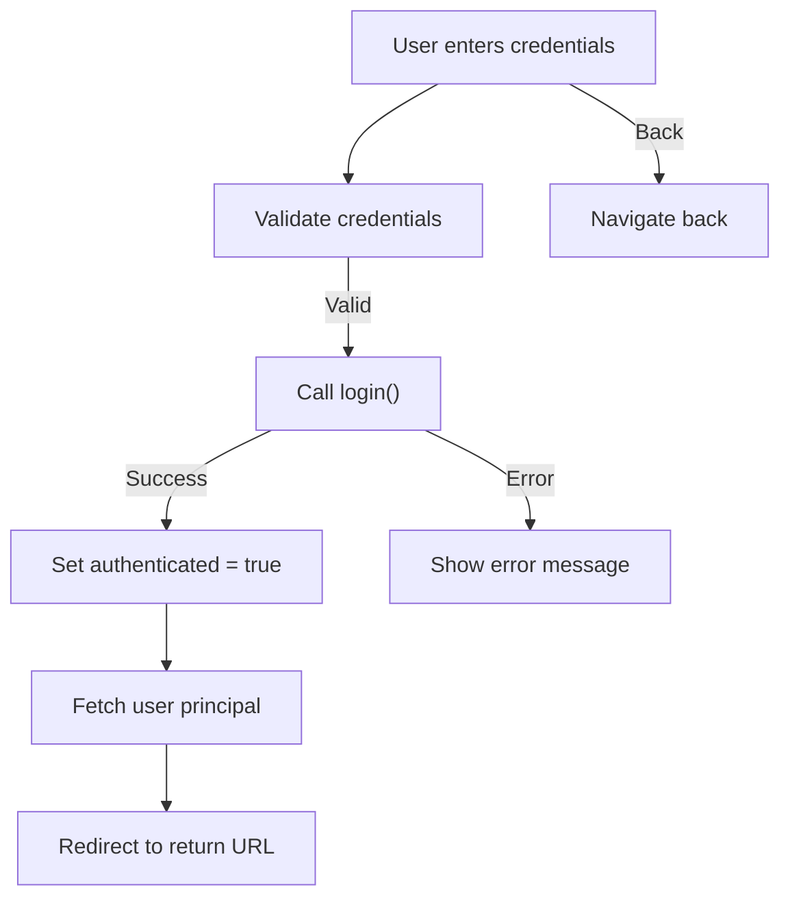
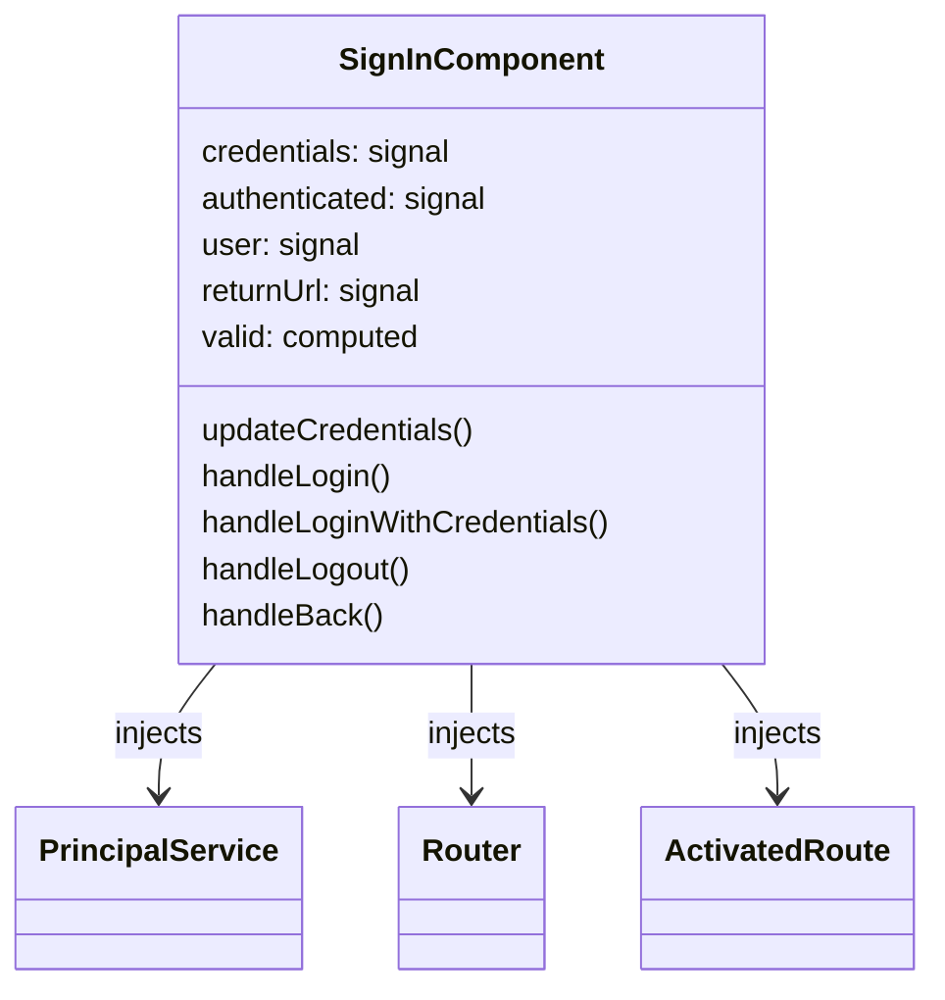
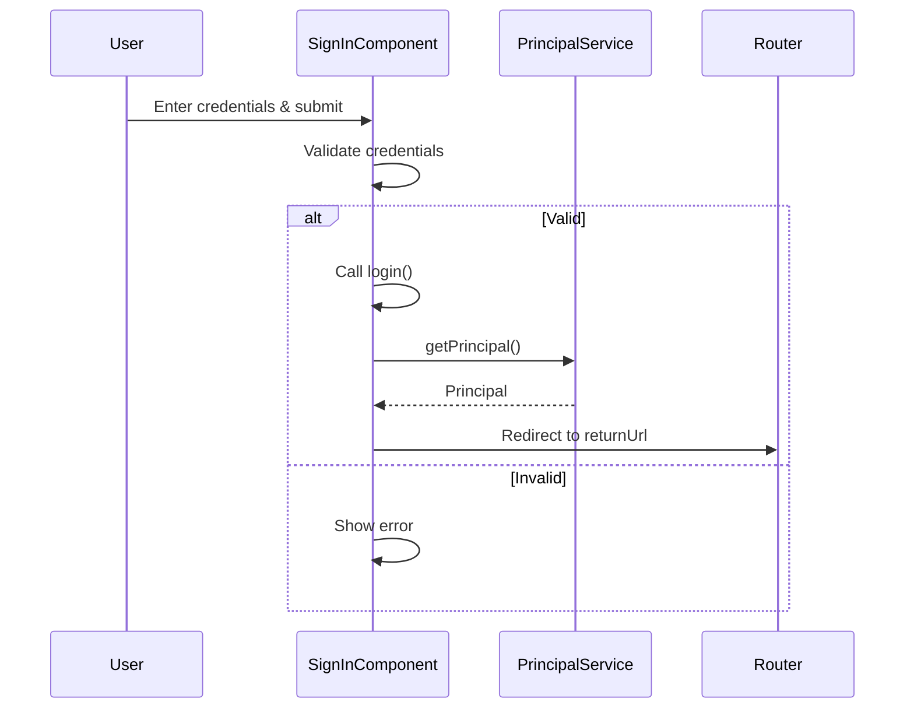

The `SignIn` component provides a user authentication interface for your Angular application. It manages user login, logout, and authentication state, and integrates with application services and stores for a seamless sign-in experience.

## Usage

```ts title="sample.component.ts"
import { SignInComponent } from "@sinequa/atomic-angular";

@Component({
    selector: "sample-component",
    imports: [SignInComponent],
    template: `
    <sign-in />
    `,
})
export class SampleComponent {
    // The component automatically handles user authentication state
    // and redirects to the return URL after successful login
}
```

## Properties

| Property         | Type                       | Description                                 |
|-----------------|----------------------------|---------------------------------------------|
| `credentials`   | `signal<Credentials>`      | Signal holding the current username and password |
| `authenticated` | `signal<boolean>`          | Whether the user is currently authenticated |
| `user`          | `signal<Principal \| null>` | The current user principal, if authenticated |
| `returnUrl`     | `signal<string[] \| null>`  | The URL to redirect to after login          |
| `valid`         | `computed<boolean>`        | Whether the entered credentials are valid   |

## Features

- Handles user login and logout
- Supports login with or without credentials
- Manages authentication state and user principal
- Redirects to the return URL after successful login
- Provides UI feedback for login errors
- Uses Angular signals and effects for reactive behavior

## Extending the Sign In Component

External developers can extend this component to customize it for their specific needs. Here's how to create a custom sign-in component:

```ts title="custom-sign-in.component.ts"
import { Component, inject } from '@angular/core';
import { SignInComponent } from '@sinequa/atomic-angular';

@Component({
  selector: 'custom-sign-in',
  template: `
    <div class="custom-signin-container">
      <form (ngSubmit)="handleLoginWithCredentials()">
        <input type="text" [(ngModel)]="credentials().username" placeholder="Username" />
        <input type="password" [(ngModel)]="credentials().password" placeholder="Password" />
        <button type="submit" [disabled]="!valid()">Sign In</button>
      </form>
      <button (click)="handleLogin()">Sign In with SSO</button>
      <button (click)="handleBack()">Back</button>
    </div>
  `,
  styles: [`
    .custom-signin-container {
      display: flex;
      flex-direction: column;
      align-items: center;
      gap: 1rem;
      padding: 2rem;
    }
  `]
})
export class CustomSignInComponent extends SignInComponent {
  // You can override methods or add additional properties
  // For example, customize error handling or UI
}
```

### Customization Options

When extending the sign-in component, consider customizing these aspects:

1. **Visual Appearance**:
   - Change the form layout, add branding, or use custom input components
   - Add error messages, loading indicators, or help links

2. **Behavior Customization**:
   - Override login or logout methods to integrate with external authentication providers
   - Add multi-factor authentication or custom validation logic
   - Customize redirect logic after login

3. **Additional Features**:
   - Add support for social login or SSO
   - Integrate with analytics or audit services
   - Display user profile or session information after login

## Template Structure

```html
<div class="flex min-h-screen items-center justify-center">
  <form class="w-full max-w-sm" (ngSubmit)="handleLoginWithCredentials()">
    <input type="text" [(ngModel)]="credentials().username" placeholder="Username" />
    <input type="password" [(ngModel)]="credentials().password" placeholder="Password" />
    <button type="submit" [disabled]="!valid()">Sign In</button>
  </form>
</div>
```

## Visual Schema

### Component Flow Diagram



### Component Architecture



### Authentication Flow


