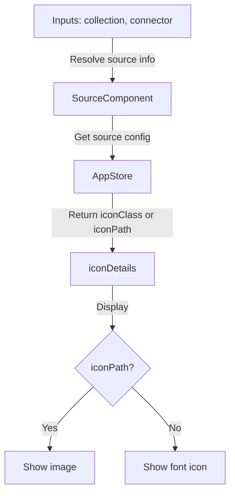
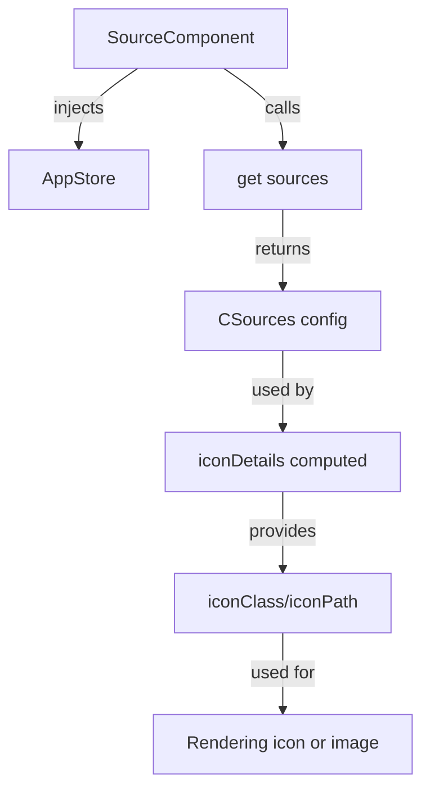

## Overview

The `SourceComponent` displays an icon representing the source or collection of a document. It automatically selects the appropriate icon or image based on the provided collection and connector, using the application's source configuration.

## Features

- Displays a source icon or image for a given collection or connector
- Automatically resolves the icon from the application's source configuration
- Supports both font icons and custom image paths
- Fully standalone and can be used in any Angular template

## Inputs

- `collection` (optional): An array of strings representing the collection path (e.g., `["collection/myCollection"]`)
- `connector` (optional): The connector name (string)

## Usage

```html
<source [collection]="['collection/myCollection']" [connector]="'myConnector'" />
```

## Example

```ts
@Component({
  selector: 'my-component',
  template: `
    <source [collection]="['collection/myCollection']" [connector]="'myConnector'" />
  `,
  imports: [SourceComponent]
})
export class MyComponent {}
```

## Notes

- If a custom icon path is available, it will be displayed as an image; otherwise, a font icon is shown.
- The component uses the application's source configuration to resolve the icon.

## Schema



- The component receives `collection` and/or `connector` as inputs.
- It queries the application's source configuration via AppStore to resolve the appropriate icon.
- If a custom icon path is found, it displays an image; otherwise, it shows a font icon.

## Store Interaction Schema



- The component injects `AppStore` to access the application's source configuration.
- It calls `sources()` from the store to get the `CSources` config.
- The `iconDetails` computed property uses this config to determine the correct icon or image.
- The result is used to render either an image or a font icon in the template.
