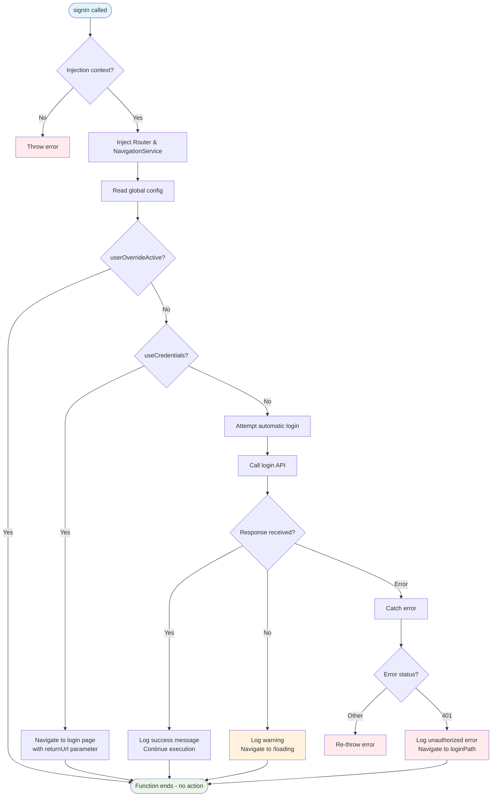
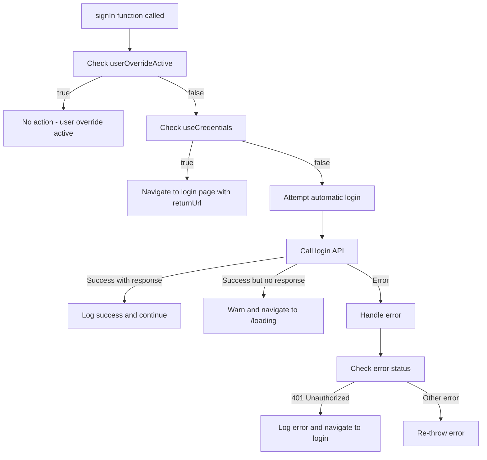
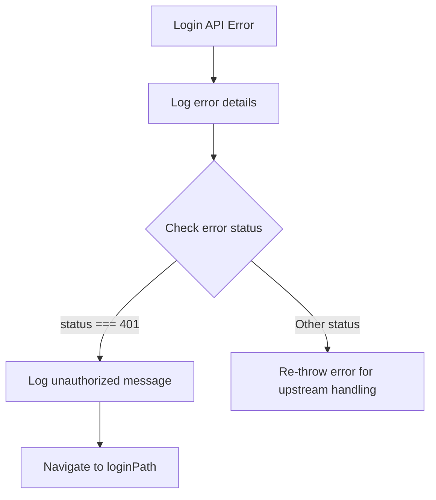

## signIn()

The `signIn` function checks the authentication status and handles routing based on the global configuration. It supports both credential-based and automatic login flows.

### Parameters

This function uses Angular's dependency injection and doesn't require explicit parameters. It injects:

- `Router` - For navigation
- `NavigationService` - To get the URL after navigation

### Configuration Dependencies

The function relies on the following global configuration properties:

| Property           | Type      | Description                                                   |
|-------------------|-----------|---------------------------------------------------------------|
| `useCredentials`  | `boolean` | Whether to use credential-based authentication               |
| `loginPath`       | `string`  | The path to redirect to for login                           |
| `userOverrideActive` | `boolean` | Whether user override is currently active                 |

### Complete Flow Diagram



### Authentication Flow



### Error Handling Flow



### Usage

```ts title="app.config.ts"
export const appConfig: ApplicationConfig = {
  providers: [
    provideAppInitializer(() => signIn()),
    ...
  ]
}
```

### Implementation Details

The function performs the following steps:

1. **Injection Context Check**: Ensures it's called within an Angular injection context
2. **Service Injection**: Injects required services (Router, NavigationService)
3. **Configuration Check**: Reads global configuration for authentication strategy
4. **Conditional Authentication**:
   - If `userOverrideActive` is true, no authentication is performed
   - If `useCredentials` is true, redirects to login page with return URL
   - Otherwise, attempts automatic login via API
5. **Error Handling**: Handles login failures with appropriate routing

### Error Scenarios

- **401 Unauthorized**: Redirects to login page
- **No Response**: Redirects to loading page with warning
- **Other Errors**: Re-throws for upstream error handling
