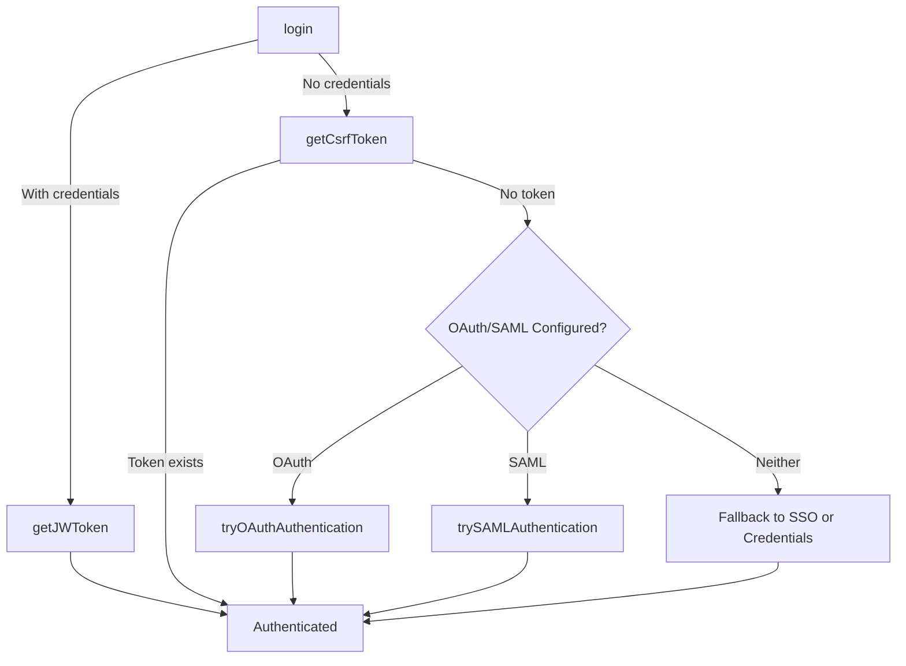

Logs in the user with the provided credentials, or attempts SSO/OAuth/SAML if no credentials are provided. Emits a custom `'authenticated'` event with the authentication status (`true` or `false`).

| parameter    | type          | description                |
| ------------ | ------------- | -------------------------- |
| credentials? | `Credentials` | Optional user credentials. |

## Example

```js title="login.js"
login().then(console.log);
// displays true if authentication succeeded, otherwise false
```

```js title="login-credentials.js"
login({ username: 'user', password: 'pa$$word' }).then(console.log);
// displays true if authentication succeeded, otherwise false
```

## Authenticated Event

A custom DOM event `'authenticated'` is emitted with `{ authenticated: boolean }` in its `detail`.

```js
document.addEventListener('authenticated', (event) => {
  console.log('Authenticated:', event.detail.authenticated);
});
```

### Authentication Flow Schema


