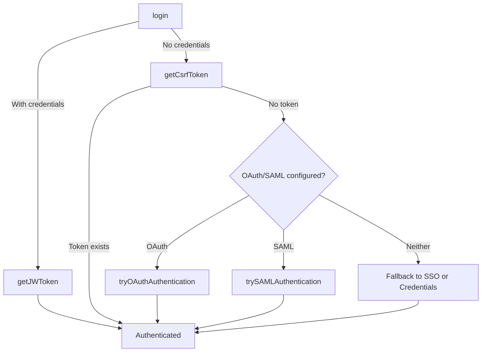

Logs in the user. If credentials are provided, authenticates using a JWT token request. If no credentials are given, attempts SSO, then OAuth/SAML if configured.

Emits a `'authenticated'` DOM event with `{ authenticated: boolean }` in its `detail` property upon completion.

**Parameters**

| Parameter | Type | Required | Description |
|-----------|------|:--------:|-------------|
| `credentials` | `Credentials` | | Optional username/password credentials |

**Returns** `Promise<boolean>` — `true` if authentication succeeded, `false` otherwise.

**Example**

```typescript title="login.ts"
import { login } from '@sinequa/atomic';

// SSO / OAuth / SAML login (no credentials)
const success = await login();
console.log('Authenticated:', success);

// Credential-based login
const success = await login({ username: 'user', password: 'pa$$word' });
console.log('Authenticated:', success);
```

## Authenticated Event

The `'authenticated'` event is dispatched on `document` (and bubbles) when login completes:

```typescript
document.addEventListener('authenticated', (event: Event) => {
  const { authenticated } = (event as CustomEvent).detail;
  console.log('Authenticated:', authenticated);
});
```

## Authentication Flow


