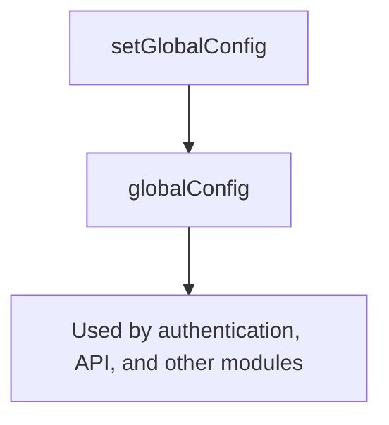

## Overview

This module provides functionality for managing global configuration settings essential for connecting to the Sinequa platform. It includes:

- A global configuration object with default values for API paths and backend URLs
- A function to set and customize the global configuration
- Various configuration options to control authentication methods, user overrides, logging, and API interactions

These tools allow developers to centralize and easily adjust application-wide settings, ensuring consistent configuration across the application for seamless integration with Sinequa services.

### globalConfig

This object contains the global configuration to enable connection to the Sinequa platform.  

:::info
By default the `globalConfig` object contains the following values:

```json
{ 
  "apiPath": "api/v1", 
  "loginPath": "/login", 
  "backendUrl": window.location.origin 
}
```

:::

```typescript title="AppGlobalConfig Type"
export type AppGlobalConfig = {
  app: string;
  backendUrl: string;
  apiPath: string;
  autoOAuthProvider: string;
  autoSAMLProvider: string;
  loginPath: string;
  userOverride: {
    username: string;
    domain: string;
  };
  userOverrideActive: boolean;
  useCredentials: boolean;           // when true, the credentials are sent with the request
  useSSO: boolean;                   // when true, SSO is used
  useCredentialsOrSSO: boolean;      // when true, maybe SSO or credentials are used
  useSAML: boolean;                  // when true, SAML is used even if OAuth is available
  logLevel: LogLevel;                // controls the application log level
};
```

#### Example

```js title="example-config.ts"
import { globalConfig } from "@sinequa/atomic";

console.log("configuration", globalConfig);
// Output: { apiPath: "api/v1", loginPath: "/login", backendUrl: <your-current-url> }
```

### setGlobalConfig()

Sets the global configuration for the application.  
Use this function when you need to customize the global configuration within your application.

| parameter | type | description |
| --- | --- | --- |
| config | `Partial<AppGlobalConfig>` | The partial configuration object to be merged with the existing global configuration. |

#### Example

```js title="example-get-global-config.ts"
import { globalConfig, setGlobalConfig } from "@sinequa/atomic";

// update the configuration with the `app` property
setGlobalConfig({ app: "training" })

const conf = globalConfig;
// will display: { app: "training", apiPath: "api/v1", loginPath: "/login", backendUrl: <your-current-url> }
```

---

## Configuration Schema



---

## Summary Table

| Property                | Purpose                                                      |
|-------------------------|--------------------------------------------------------------|
| app                     | Sinequa application name                                     |
| backendUrl              | URL of the backend server                                    |
| apiPath                 | API path for requests                                        |
| autoOAuthProvider       | Name of the OAuth provider                                   |
| autoSAMLProvider        | Name of the SAML provider                                    |
| loginPath               | Login path                                                   |
| userOverride            | User override credentials (username, domain)                 |
| userOverrideActive      | Whether user override is active                              |
| useCredentials          | Use credentials for authentication                           |
| useSSO                  | Use SSO for authentication                                   |
| useCredentialsOrSSO     | Use SSO or credentials for authentication                    |
| useSAML                 | Use SAML even if OAuth is available                          |
| logLevel                | Application log level                                        |

---

**Note:**

- All properties are optional when calling `setGlobalConfig`, but the full type is shown above for reference.
- The actual `globalConfig` object may contain additional properties for extensibility.
