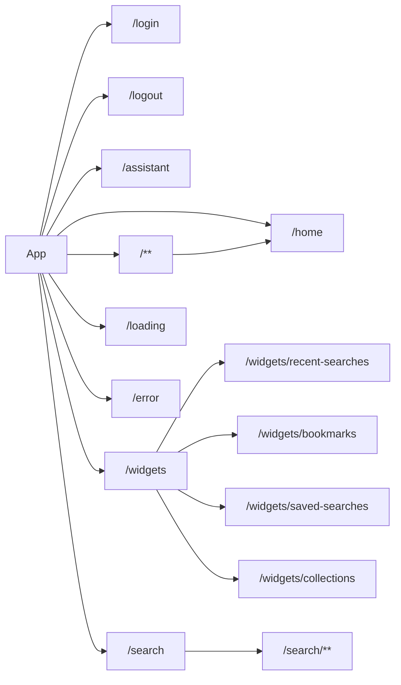

This document provides a high-level overview of how routing is structured and managed within the application.
Understanding routing is key to understanding how users navigate between different sections and features.

## Routing fundamentals

In web applications, routing is the mechanism that directs users to different views or pages based on the URL they visit.
When a user clicks a link or types a URL into the browser, the routing system determines which component or content should be displayed.

## Visualizing route structure

By default, Mint has a pretty simple and straight forward routing.
A simplified view of the main application routes is shown below:



We'll explore the routing configuration in detail, including how to define routes, use guards, and manage lazy loading of components, following this structure.

## The `routes.ts` file

The core of our application's routing configuration resides in the `src/app/routes.ts` file.
This file defines an array of route objects that map URL paths to specific Angular components.

The application uses Angular's standard `Route` type, but extends it with custom types `ExtendedRoute` and `ExtendedData` to include additional application-specific information.

```typescript title="src/app/routes.ts"
import { Data, Route } from '@angular/router';
// ...

// Extended types to add custom properties to routes
type ExtendedData = Data & {
  queryName?: string;           // name of the query defined in the admin
  display?: string;             // label you want to display in the interface
  wsQueryTab?: string;          // name of the "tab" associated with the query you want to use
  icon?: string;                // icon you want to associate with the label in the interface
  [key: string | symbol]: any;  // anything you might need
};
type ExtendedRoute = Route & {
  data?: ExtendedData;          // custom data for the route
  children?: ExtendedRoutes;    // nested routes
};
type ExtendedRoutes = ExtendedRoute[];

export const routes: ExtendedRoutes = [
  // route definitions
];
```

## Structure of a Route Definition

Each route in the `routes` array is an object with several key properties:

* `path`: A string that defines the URL segment for this route (e.g., `'home'`, `'search'`).
* `component`: The Angular component that should be rendered when this route is active (e.g., `HomeComponent`).
* `loadComponent`: Used for lazy loading components.
    Instead of loading the component's code upfront, it's loaded only when the route is accessed.
    This improves initial application load time.

    ```typescript title="Example of lazy-loaded route"
    {
      path: 'assistant',
      loadComponent: () => import('./pages/assistant/assistant.layout').then(m => m.AssistantLayoutComponent),
      // ...
    }
    ```

    :::tip
      Lazy loading is a powerful feature that helps reduce the initial bundle size of your application, improving performance.
      It is a common good practice to use lazy loading for routes that are not immediately needed when the application starts.
    :::
    :::warning
      You **cannot** define a `component` property when using `loadComponent`.
      The `loadComponent` function must be used to specify the component to load.
    :::
* `canActivate`: An array of route guards.
    Guards are functions that run before a route is activated, allowing you to control access based on certain conditions (e.g., whether a user is authenticated).

    ```typescript title="Example of a route with guards"
    {
      path: 'home',
      component: HomeComponent,
      canActivate: [AuthGuard()], // Ensures user is authenticated and app is initialized
      // ...
    }
    ```

    :::tip
      Guarding a parent route (like `/search`) will also protect all child routes declared in `children`.
    :::
* `resolve`: An object where each property is an [Angular `ResolveFn`](https://angular.dev/api/router/ResolveFn).
    Resolvers fetch data needed for a route before the component is activated.
    For example, `queryNameResolver` will fetch the name of your **default** query in your administration.
    :::note
      The *default* query is the first one declared in your query webservice configuration.
    :::
* `children`: An array of child routes.
    This allows for nested routing, where a section of the application has its own sub-navigation (e.g., the `/widgets` section can have children like `/widgets/bookmarks`).
* `redirectTo`: Specifies a path to redirect to if this route is matched.
    Often used for default routes or redirecting old URLs.
* `data`: An object (`ExtendedData` in our case) to store arbitrary data associated with this specific route.
    This is where our custom properties come into play.

## Custom route properties (`ExtendedData`)

The `ExtendedData` type allows us to attach custom metadata to our routes.
This metadata can be used by components or services to alter behavior or display.
Key custom properties include:

| Property                       | Description                                                                                                   |
|---------------------------------|---------------------------------------------------------------------------------------------------------------|
| `queryName`                     | Specifies the name of the query webservice to invoke for this route.<br/>_Make sure your query is available from your application in the administration, or globally available._ |
| `display`                       | A user-friendly label for the route.                                                                         |
| `wsQueryTab`                    | The name of a "tab" associated with a specific query.                                                        |
| `icon`                          | An icon to be displayed alongside the route's label in the UI.                                               |
| `[key: string \| symbol]: any;` | Allows for any other custom parameters to be added as needed.                                                 |

:::note
Some of these `ExtendedData` properties, particularly those related to display and configuration (like `display`, `icon`, or specific query parameters), might be populated or augmented using data from an external JSON configuration file.
The specifics of how this JSON file is used will be detailed in a separate section.
:::

## Key Route Examples and Their Purpose

Let's look at some important routes defined in `src/app/routes.ts`:

* **Authentication routes**:
    These handle user login and logout.

    ```typescript title="src/app/routes.ts"
    { path: 'login', component: SignInComponent },
    { path: 'logout', component: SignInComponent },
    ```

* **Home route**:
    This is typically the main landing page after a user logs in.
    It's protected by `AuthGuard` (user must be logged in) and `InitializationGuard` (application must be initialized).

    ```typescript title="src/app/routes.ts"
    {
      path: 'home',
      component: HomeComponent,
      canActivate: [AuthGuard()],
      resolve: { queryName: queryNameResolver }
    },
    ```

* **Assistant route (lazy loaded)**:
    This route loads the `AssistantLayoutComponent` on demand.

    ```typescript title="src/app/routes.ts"
    {
      path: 'assistant',
      loadComponent: () => import('./pages/assistant/assistant.layout').then(m => m.AssistantLayoutComponent),
      canActivate: [AuthGuard()],
      resolve: { queryName: queryNameResolver }
    },
    ```

* **Widgets routes (nested structure)**:
    The `/widgets` path uses `WidgetsLayoutComponent` as a container and defines child routes for specific widgets like recent searches and bookmarks.

    ```typescript title="src/app/routes.ts"
    {
      path: 'widgets',
      component: WidgetsLayoutComponent,
      canActivate: [AuthGuard()],
      children: [
        { path: 'recent-searches', component: RecentSearchesComponent, /* ...guards */ },
        { path: 'bookmarks', component: BookmarksComponent, /* ...guards */ },
        // ... other widget routes
      ]
    },
    ```

* **Search route**:
    This handles the main search functionality
    The `children` array with `path: '**'` acts as a wildcard, meaning any path under `/search/...` will render the `SearchAllComponent`.
    This is useful to keep the global layout for all search pages while using specific view for each search result types.

    ```typescript title="src/app/routes.ts"
    {
      path: 'search',
      component: SearchLayoutComponent,
      canActivate: [AuthGuard()],
      resolve: { queryName: queryNameResolver },
      children: [
        { path: '**', component: SearchAllComponent, resolve: { queryName: queryNameResolver } }
      ]
    },
    ```

* **Utility and fallback routes**:
    These provide components for loading states, error display, and a general fallback mechanism.

    ```typescript title="src/app/routes.ts"
    { path: 'loading', component: LoadingComponent },
    { path: 'error', component: ErrorComponent },
    { path: '**', redirectTo: 'home', pathMatch: 'full' } // Wildcard: redirects any unmatched URL to 'home'
    ```

    :::important
      The wildcard route (`path: '**'`) is a catch-all that redirects any unmatched URL to the home page.
      Take care to place it at the end of your routes array to ensure it does not override more specific routes.
    :::

## Simple tutorials & snippets

Here are a few focused examples to illustrate common routing patterns:

**1. Defining a basic route**:
This shows the simplest form of a route, mapping a path to a component.

```typescript title="src/app/routes.ts"
// ...
{
  path: 'some-feature', // The URL will be your-app.com/some-feature
  component: SomeFeatureComponent // The component to display
}
// ...
```

**2. Protecting a route with a guard**:
This route can only be accessed if the `AuthGuard` allows it (e.g., user is logged in).

```typescript title="src/app/routes.ts"
// ...
{
  path: 'profile',
  component: UserProfileComponent,
  canActivate: [
    AuthGuard()             // Only authenticated users can access
  ]
}
// ...
```

**3. Creating nested routes**:
This defines a main `/search` route with child routes for `/search/all` (generic search document) and `/search/slides` (slide focused result presentation).

```typescript title="src/app/routes.ts"
// ...
{
  path: 'search',
  component: SearchLayoutComponent,
  canActivate: [AuthGuard()],
  resolve: { queryName: queryNameResolver },          // Resolve the default query name
  children: [
    { path: 'slides', component: SearchSlidesComponent }
    { path: '**', component: SearchAllComponent, queryName: queryNameResolver },
    // wildcard path matches all others search/* routes and use default component and query
  ]
}
// ...
```

:::info
  Note that the `SearchLayoutComponent` serves as a container for the child routes, allowing for a consistent layout while displaying different components based on the sub-path, you **need** to use the `router-outlet` directive in the `SearchLayoutComponent` template to render the child components.
:::
