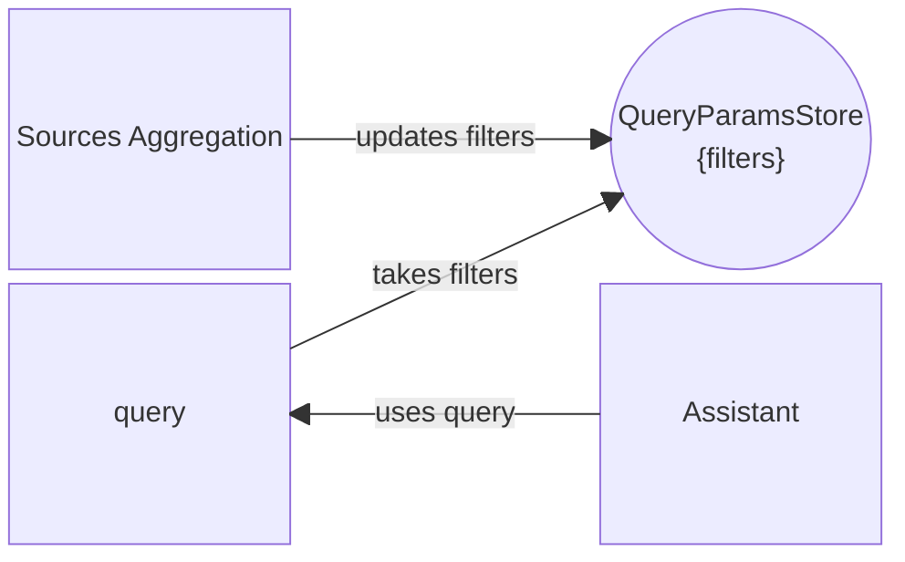

The Assistant page allows to chat with an assistant and to provide it with some context to find answers inside. For this, on the left side of the page are some components facilitate the filtering with a Sources aggregation filter component, and an upload component allowing to upload additional documents that can be choosen upon filtering in the "My Documents" source. 

## Interactions

The assistant source filtering is made possible with it taking the current query which includes the filters stored in the Query Params Store.

