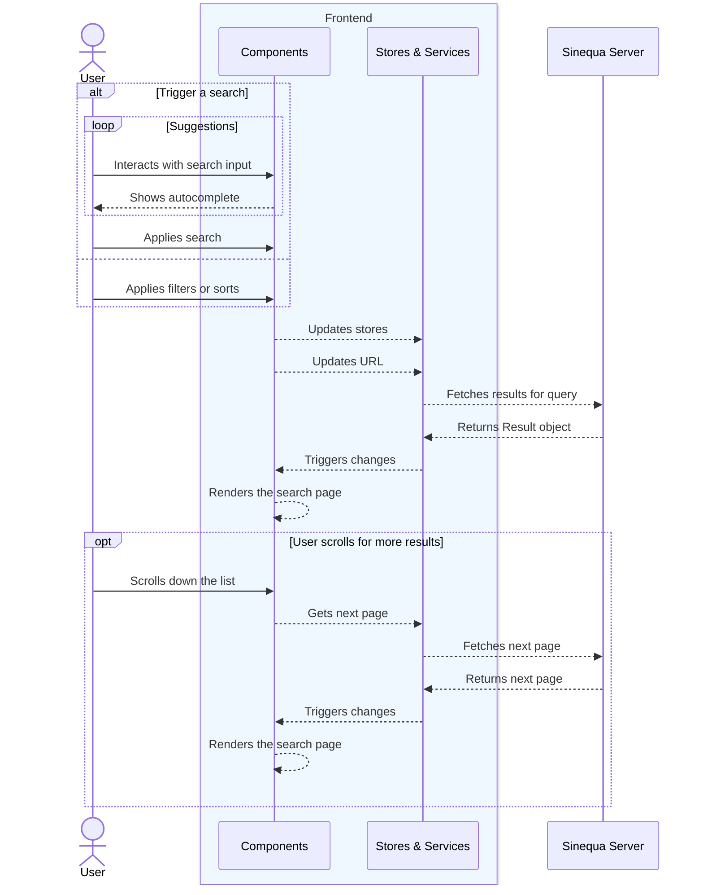

Search can be complex at it involves many components working together, like stores, services, and the Sinequa search engine.
Understanding how search functions in our application is a requirement to build your own blocks and components.

This guide breaks down the process into simple steps.

## Before we start

### Terminology

Quick note on the terminology:
*   **Query**: The complexe object that contains all the information about your search, including text, filters, sorting, pages and more.
*   **Result**: The object returned by the Sinequa server, containing documents, aggregations and more.
*   **Article** or **Record**: An individual document in the search results.
*   **Service**: An Angular service that handles specific tasks, like fetching data from the Sinequa server.
*   **Store**: An Angular service that holds the state of the application, like the current query params or user settings.

### Dependencies

Mint uses new Angular features like *standalone components* and *injectable services*, which allows us to create a modular and flexible architecture.
But also [*signals*](https://angular.dev/guide/signals), which are a new way to handle state changes in Angular, making it easier to manage the flow of data, and reactivity of components, services and stores in the application.

Queries are built using a combination of user input, filters, and sorting options. The application then sends this query to the Sinequa server, which processes it and returns the results.
We choose to use [TanStack Query](https://tanstack.com/query/latest/docs/framework/angular/overview) to manage the data fetching and caching, which simplifies the process, as well as providing a built-in way to handle pagination, infinite scrolling and more.

## First glance

Here's a very simple and global overview of how search works, we'll then dive into the details:

## How to search

Search are triggered by few user interactions, search input, filters, tabs, etc. Here's how it works:
*   **Search input**: This is where you type your query **text**.
    *   **Autocomplete suggestions**: As you type, the system might offer suggestions to help you complete your query or show popular related searches. This is powered by our `AutocompleteService`.
    :::note
        Keep in mind that `AutocompleteService` fetches suggestions from the Sinequa server based on your input. Which means, depending on several factors, each suggestion call could be heavy to process. In Mint we use a debounce mechanism to avoid too many requests.
    :::
*   **Tabs (if available)**: Tabs are defined by your `query` configuration in the backend. You can override them in the code by defining a route in the code base.
*   **Filters**: On the side or top, you'll often see filter categories (like "Date," "Author," "Document Type"). [See more about filters](../core/filters.mdx).

When you validate your search text, select a tab, or apply a filter, the application **immediately** takes note and the search triggers.

## Search has been triggered

Once you've triggered a search (by typing, clicking tabs, or applying filters), a few things happen quickly:

*   **Building the Query**: The application takes all your inputs – your search text, the active tab, any filters you've selected, and how you want results sorted – and combines them into a formal `Query` object.
    :::note
        This query is managed internally by our `QueryParamsStore`, which keeps track of all these details. The URL in your browser also updates to reflect this query, so you can bookmark or share your exact search!
    :::
*   **Sending to the Server**: This structured query is then sent over the network to the main Sinequa search engine.
    ::note
        Our `SearchService` is responsible for this communication.
    :::
*   **The Server at Work**: The Sinequa engine receives your query and process to the search.

## Server answers

After the server has done its job, it sends the `Result` object back to the application:

*   **Displaying documents**: The main part of your screen will fill with a list of results that match your query. Each result is usually presented as a "card" showing key information.
    :::note
        The `SearchAllComponent` receives these results and uses dynamic components (from `document-type-registry`) to show each item appropriately.
    :::
*   **Updating filters**: The filter bar will update to show counts and options relevant *only* to the documents found. This helps you further refine your search.
*   **Infinite scrolling**: As you scroll down the list of results, the application automatically fetches and displays more items if available.
*   **Sponsored links**: You might see sponsored results (specially highlighted items), those are managed by the Sinequa server and displayed in the search results.
*   **Did you mean**: Sometimes you can see "Did you mean" suggestions if the system thinks you might have misspelled something.

## Interacting Further

Your initial search is often just the start:

*   **Opening Previews**: You can usually click on a search result to see a more detailed preview.
    :::note
        The `SelectionService` and `DrawerStackService` manage this.
    :::
*   **Sorting**: You can change how your results are sorted (e.g., by relevance, date).
*   **Filtering**: You can refine your search by applying another filter combination and triggering steps 2 and 3 again.
*   **Saving your search**: If you've crafted a search (text + filters) that you use often, you can usually save it for quick access later.
    :::note
        The `UserSettingsStore` and `SearchInputComponent` handle this.
    :::

## The Role of the URL

Notice the web address (URL) in your browser as you search. It changes to reflect your current query text, filters, tab, and sort order.
*   **Bookmarkable**: You can bookmark this URL. If you find it more convienent than using the *Saved Searches* feature.
*   **Reproducible**: You can copy and paste this URL to share your exact search results with a colleague.
    :::warning
        Be aware that search will be triggered with **current authenticated user**, so results may vary based on permissions and user settings.
    :::
